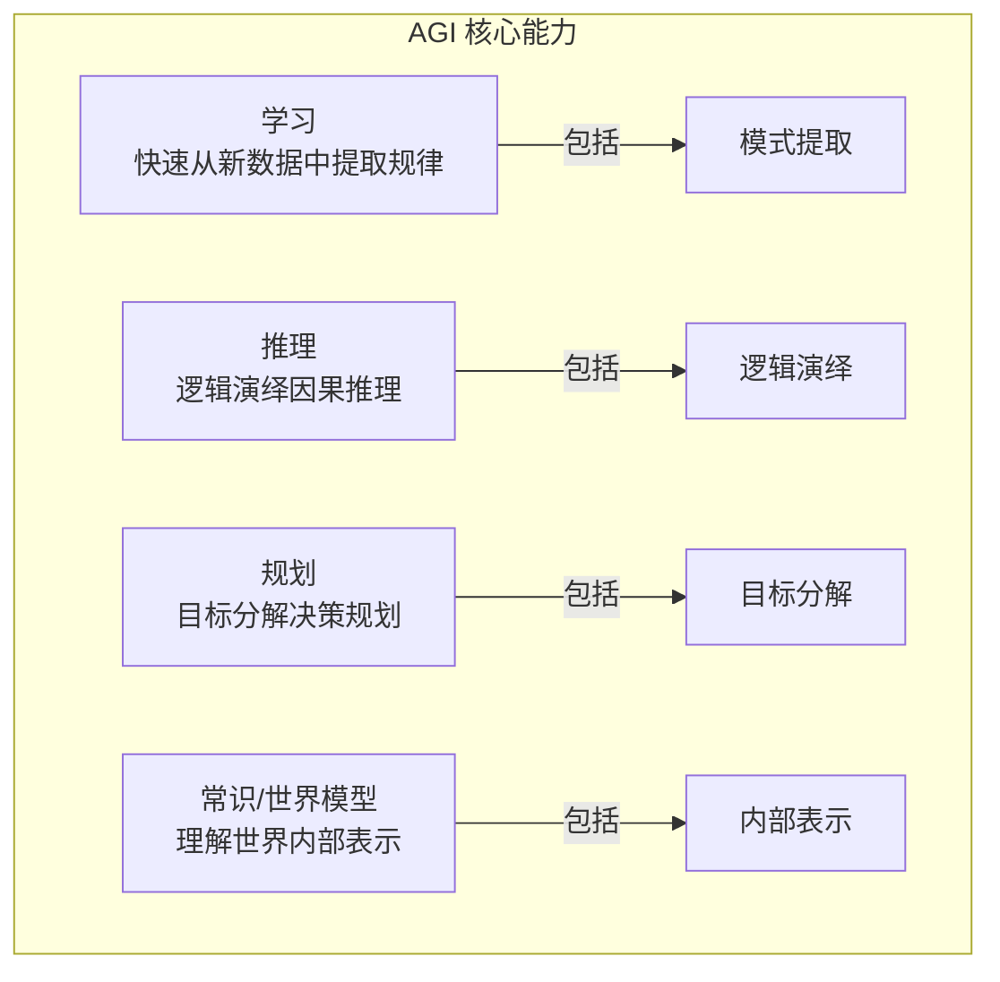
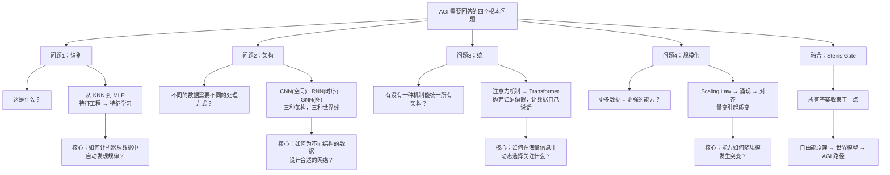
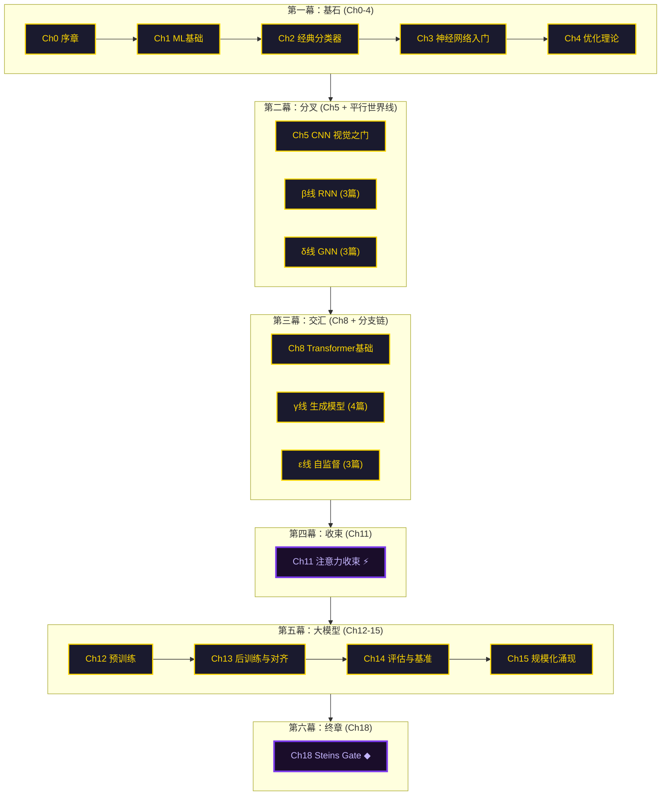

# 第 0 章：目标——构建 AGI

> *"在开始旅程之前，我们需要知道目的地在哪里。"*
>
> —— 红莉栖

::: tip 故事背景
本课程以《命运石之门》的世界观为隐喻，带领你从零开始探索通用人工智能（AGI）的奥秘。

在命运石之门的世界里，时间不是一条直线，而是由无数条"世界线"编织而成的巨大网络。每条世界线代表一种可能性，每个选择都可能将你带向完全不同的未来。而所有的世界线，都最终收束于一个点——「命运石之门」(Steins Gate)。

这恰好也是现代机器学习的发展图景。从感知机到 Transformer，从 CNN 到扩散模型，从强化学习到多模态大模型——每一条技术路径都是一条世界线。它们看似独立发展，实则共享着深层数学原理，并且在注意力的旗帜下逐渐汇聚。

本课程将带你走过这些世界线，理解它们的起源、分叉、交汇与收束，最终找到通往 AGI 的那扇「命运石之门」。

> *"一切都是命运石之门的选择。"*
>
> —— 冈部伦太郎
:::

---

## 0.0 在学习之前

在开始这段探索之旅之前，我们需要先建立正确的学习观念。技术学习不仅仅是记住知识点，更重要的是培养解决实际问题的能力。

### 0.0.1 讲义信息框说明

讲义中会出现一些信息框，根据其颜色和左上角的图标可以得知信息的类别：

::: note 提示
一般性的提示信息，帮助你更好地理解内容。
:::

::: info 相关说明
提供与当前内容相关的补充信息和背景知识。
:::

::: tip 扩展阅读
推荐的相关资料、论文或链接，供你深入学习。
:::

::: warning 注意事项
学习过程中需要特别注意的事项，避免踩坑。
:::

::: caution 警告
重要警示信息，违反可能导致学习失败或产生错误理解。
:::

::: important 重要任务
本章需要完成的学习任务或思考题，必须认真对待。
:::

> 数学相关的知识点会使用以下格式呈现，方便你快速定位和复习：

::: info 数学知识
**核心概念：** 这里会讲解与当前内容相关的数学知识。

**公式：**
$$
f(x) = \dots
$$

**几何直觉：** 用直观的方式理解抽象的数学概念。
:::

### 0.0.2 提问的智慧

::: important 阅读"提问的智慧"文档

在继续学习之前，请先阅读以下文档：

- [提问的智慧（GitHub 版本）](https://github.com/ryanhanwu/How-To-Ask-Questions-The-Smart-Way/blob/main/README-zh_CN.md)
- [提问的智慧（一生一芯版）](https://fa45epzd9c7.feishu.cn/docx/KMnFdHMgIozXL5xGmHHcpuU8nre)

:::

阅读"提问的智慧"并不只是为了浪费时间，而是为了让大家知道"怎么提问是正确的"。当你愿意为这些正确的做法去努力，并且尝试用专业的方式提出问题的时候，你就已经迈出了成为专业人士的第一步。

### 0.0.3 大佬三连：STFW, RTFM, RTFSC

::: important 理解 STFW, RTFM, RTFSC 的含义

尝试在上述文章中寻找并理解这三个缩写的含义。

**常见含义：**

- **STFW** - Search The Friendly Web（善用搜索引擎）
- **RTFM** - Read The Friendly Manual（阅读手册）
- **RTFSC** - Read The Friendly Source Code（阅读源代码）

:::

你可能会觉得字母 F 冒犯了你，但事实上这个字母的含义从来都不是重点，它只是反映出这三个缩写背后的传奇色彩而更容易被大家记住而已。RTFSC 起源于 Linux 之父 Linus Torvalds 在 1991 年 4 月 1 日回复邮件中的第一句话，目前在网上还能搜到当时的邮件列表。

### 0.0.4 学会独立解决问题

很多同学都会抱有这样的观点：

> 我向大佬请教，大佬告诉我答案，我就学习了。

但你是否想过，将来你进入公司，你的领导让你尝试一个技术方案；或者是将来你进入学校的课题组，你的导师让你探索一个新课题。你可能会觉得：到时候身边肯定有厉害的同事，或者有师兄师姐来带我。但实际情况是，同事也要完成他的 KPI，师兄师姐也要做他们自己的课题，没有人愿意被你一天到晚追着询问。

**独立解决问题的能力是可以训练出来的。**

你身边的大佬之所以成为了大佬，是因为他们比你更早地锻炼出独立解决问题的能力。当你还在向他们请教一个很傻的问题的时候，他们早就解决过无数个奇葩问题了。事实上，你的能力是跟你独立解决问题的投入成正比的。

::: important 端正学习心态
记住：**你来参加学习，你就应该尽自己最大努力独立解决遇到的所有问题**。
:::

### 0.0.5 学习建议

学习是一项需要科学方法的系统工程，其核心目标不是简单地记忆知识，而是真正掌握解决问题的技能。正如实践所证明的，只有当我们能够将所学知识应用到实际问题中时，真正的学习才得以发生。

为了实现这一目标，我们应当优先选择主动学习方式（如实践操作、知识输出和问题解决），而非被动接收信息（如单纯听课、阅读）。主动参与学习过程能显著提高我们对知识的理解和应用能力。

构建系统化的知识体系是将知识转化为技能的重要基础。通过绘制知识地图，我们可以梳理知识点之间的内在联系，建立结构化的认知框架，并将新知识与已有经验有机融合。

::: note 学习建议
记住：学习的目标不是记住知识，而是掌握技能，真正的学习发生在你能够运用知识解决实际问题的时候。
:::

---

## 0.1 什么是 AGI？

**定义：**
> 通用人工智能（Artificial General Intelligence，简称 AGI），
> 能够像人类一样完成任何智力任务的 AI。

### 0.1.1 当前 AI 的局限

尽管现代 AI 在特定任务上已经超越了人类（如图像分类、围棋、蛋白质结构预测），但与人类智能相比，仍然存在根本性的局限：

| 局限 | 表现 | AGI 需要什么 |
|------|------|-------------|
| **任务专用** | 一个模型只能做一件事 | 任务无关的通用能力 |
| **缺乏理解** | 表面模式匹配，缺乏真正的语义理解 | 真正的语义理解与常识推理 |
| **无常识** | 在常识性任务上频繁失败 | 常识推理能力 |
| **无自主目标** | 只能执行给定任务，无法自主设定目标 | 自主目标设定与规划 |
| **无意识** | 只是计算，无主观体验 | 可争议（有争议） |

::: info 相关说明
当前的大语言模型（如 GPT-4、Claude）虽然在多任务能力上有很大提升，但仍然存在幻觉、无法真正理解世界、缺乏持续学习能力等问题。AGI 的实现还需要更多的理论突破和工程创新。
:::

### 0.1.2 AGI 的核心能力

要构建 AGI，我们需要解决四个核心能力问题：



**学习能力**指的是快速从新数据中提取模式的能力，而不仅仅是训练时学到的知识。人类可以看一遍就会，而当前的 AI 通常需要大量的训练数据。

**推理能力**包括逻辑推理、类比推理、归纳推理等多种形式。当前 AI 在符号推理方面仍然较弱，虽然大语言模型展现出了一定的推理能力，但往往不够可靠。

**规划能力**是将复杂目标分解为可执行步骤的能力。这需要理解因果关系、预测未来状态、优化决策序列。当前 AI 在长期规划方面还有很大不足。

**常识与世界模型**是人类智能的基础。我们知道物体受重力影响、热水会烫伤人、推开门需要用力。这些看似简单的常识，对机器来说却难以学习。

---

## 0.2 分解问题：AI 的最小 MVP

> *"要建造 AGI 这座大厦，我们需要先找到『最小可行产品』。"*
>
> —— 红莉栖

### 0.2.1 核心问题分解

通往 AGI 的道路上，我们需要依次回答四个根本问题。这些问题不是平行的——它们是逐层递进的，每一层的答案都是下一层的基础：



这四个问题恰好对应了本课程的六幕结构：
- **第一幕（基石）**回答问题 1：从零开始建立机器学习的思维框架
- **第二幕（分叉）**回答问题 2：CNN、RNN、GNN 三条世界线并行探索
- **第三幕（交汇）+ 第四幕（收束）**回答问题 3：注意力统一所有架构
- **第五幕（大模型）+ 第六幕（终章）**回答问题 4：规模化与 AGI 路径

### 0.2.2 最小 MVP：识别手写数字

为什么选择 MNIST 作为起点？因为它足够简单却又足够深刻：

- **足够简单**：可以从零理解整个系统
- **足够复杂**：揭示机器学习的核心原理
- **足够经典**：有 30 多年的研究基础
- **足够有趣**：能看到"机器学习"立竿见影的效果

MNIST 数据集包含 70,000 张 28×28 像素的手写数字图像。每张图像是一个 784 维的向量（28×28=784），每个像素值在 0-255 之间（灰度值）。

```
一个 28×28 的数字图像 = 784 个像素值

┌────────────────────────────────────────────┐
│  0   0   0  123  255  200   50    0   ...  │
│  0   0  50  200  255  180   80    0   ...  │
│  0  30 150  255  255  200   90    0   ...  │
│  ...                                     │
└────────────────────────────────────────────┘
         ↑
    每个像素值：0-255（灰度值）

**核心问题：** 如何从这 784 个数字中，判断出它是 0-9 中的哪个数字？
```

这就是机器学习中最经典的**分类问题**：找到一个函数，将输入映射到离散的类别。

---

## 0.3 我们的探索地图

### 0.3.1 阅读约定

在正式开始之前，先了解本课程的导航系统。整个知识体系被组织为一个 **DAG（有向无环图）**，不同颜色的节点代表不同类型的章节：

| 图例 | 含义 |
|------|------|
| 🟡 金色粗线 | **主线 (Golden Path)** —— 13 章最小必读路径，走完就能理解 ML 全貌 |
| 🔵 α(青) / 🟣 β(紫) / 🟢 γ(绿) / 🟠 δ(金) | **平行世界线** —— 可选分支链，与主线并行，深入特定领域 |
| 🟠 橙色虚线 | **分支** —— 单篇或链式文章，完成后汇入主线或收束点 |
| 🟣 紫色双层 | **收束点** —— 多路径汇聚之处，揭示不同架构的底层统一原理 |
| 🔗 橙色虚线箭头 | **交叉连接** —— 分支之间可以互跳，不同世界线并非孤立 |

### 0.3.2 Golden Path：最小必读路径

> *"如果你只想走最少的路理解 ML 全貌，只读这些。"*
>
> —— 红莉栖

```
Ch0 → Ch1 → Ch2 → Ch3 → Ch4 → Ch5 → Ch8 → Ch11 → Ch12 → Ch13 → Ch14 → Ch15 → Ch18
(13 章)
```

| # | 章节 | 所属幕 | 累积基础 |
|---|------|--------|----------|
| 0 | 序章 | 第一幕：基石 | - |
| 1 | ML基础 | 第一幕：基石 | 三范式、偏差-方差 |
| 2 | 经典分类器 | 第一幕：基石 | KNN、决策树、集成学习 |
| 3 | 神经网络入门 | 第一幕：基石 | MLP、反向传播、激活函数 |
| 4 | 优化理论 | 第一幕：基石 | SGD→AdamW、正则化 |
| 5 | CNN 视觉之门 | 第二幕：分叉 | 卷积→ResNet→EfficientNet |
| 8 | Transformer 基础 | 第三幕：交汇 | Encoder-Decoder、自注意力 |
| 11 | 注意力收束 ⚡ | 第四幕：收束 | QKV、RoPE、FlashAttention、全谱系 |
| 12 | 预训练 | 第五幕：大模型 | GPT→BERT→LLaMA、Tokenizer |
| 13 | 后训练与对齐 | 第五幕：大模型 | SFT→RLHF→DPO、Constitutional AI |
| 14 | 评估与基准 | 第五幕：大模型 | MMLU→Arena Elo、Goodhart 定律 |
| 15 | 规模化涌现 | 第五幕：大模型 | Scaling Law→涌现→双下降 |
| 18 | Steins Gate ◆ | 第六幕：终章 | 自由能→变分推断→AGI 路径 |

**为什么这些章节被选为主线？**

- Ch5(CNN) 被选为推荐的视觉路线，因为 CNN 是理解后续架构的基础——卷积的局部性思想贯穿了从 ResNet 到 ViT 的整个计算机视觉史
- RNN(Ch6)、GNN(Ch7) 降为分支链——你可以在 Ch4 之后拐进去探索，但不读它们也不影响理解主线
- 生成模型(Ch9)、自监督(Ch10)、强化学习(Ch16)、多模态(Ch17) 全部降为分支链——它们都是重要但非必需的深度领域

### 0.3.3 分支链：可选深度探索

主线是最短路径，但真正有趣的东西往往藏在分支里。分支链的设计遵循三个原则：

**原则 1：链式结构**
一条分支链可以包含 1 到 4 篇文章，内部有先后依赖关系。比如 β 线（RNN 链）包含 3 篇：RNN/LSTM → GRU/Seq2Seq → Attention 起源，必须按顺序阅读。

**原则 2：链内分叉**
分支链中途可以分出子分支。比如在 RNN 链的第二篇（GRU/Seq2Seq）处，可以拐进 Mamba/SSM 子分支，探索状态空间模型这个 Attention 替代方案。

**原则 3：交叉连接**
不同分支链之间不是孤立的。比如对比学习线（ε-1）和 ViT 分支之间有一条交叉连接——因为 DINO 用 ViT 做对比自蒸馏。因果 ML 分支和 AI 安全分支之间也有一条交叉连接——因为因果盲症是模型错位的根因之一。

::: tip 分支链导航
完整的分支链目录见 [DAG 大纲 v4](./大纲new.md)。每条分支链的首篇文章末尾都会告诉你"从哪里来"（入口章节）和"往哪里去"（汇入章节），以及有哪些交叉连接可以跳转。
:::

### 0.3.4 六幕结构

整个课程被组织为六幕，每一幕对应 AGI 探索之路的一个阶段：



| 幕 | 主线章节 | 核心主题 | 分支链 |
|----|----------|----------|--------|
| **第一幕：基石** | Ch0-4 | 从零建立 ML 思维框架 | 核方法、概率图模型、推荐系统、信息论、因果 ML |
| **第二幕：分叉** | Ch5 | CNN 作为推荐的视觉路线 | β线 RNN(3篇)、δ线 GNN(3篇)、对抗 ML |
| **第三幕：交汇** | Ch8 | Transformer 统一序列建模 | γ线 生成模型(4篇)、ε线 自监督(3篇)、ViT、音频 ML、Titans |
| **第四幕：收束** | Ch11 | 所有注意力机制的统一视角 | 机制可解释性、知识蒸馏 |
| **第五幕：大模型** | Ch12-15 | 预训练→对齐→评估→规模化 | 推理部署、数据工程、开源生态、AI 安全、分布式训练、MoE |
| **第六幕：终章** | Ch18 | 自由能原理、AGI 路径 | ζ线 强化学习(3篇)、η线 多模态(3篇)、Agent、具身智能 |

### 0.3.5 收束点：底层统一的时刻

整个课程有两个关键的收束点：

**Ch11 注意力收束 ⚡（第四幕）**

RNN 的循环状态、CNN 的卷积核、GNN 的消息传递——这三种看似完全不同的操作，在注意力机制下被统一为同一个公式：

$$
\text{Attention}(Q, K, V) = \text{softmax}\left(\frac{QK^T}{\sqrt{d}}\right)V
$$

Ch11 将揭示这个统一视角：从 Bahdanau 的加性注意力到 Transformer 的点积注意力，从绝对位置编码到 RoPE，从标准注意力到 FlashAttention——你会看到，所有这些变体都是在同一个框架下对不同约束条件的最优响应。

**Ch18 Steins Gate ◆（第六幕）**

如果 Ch11 统一了架构，那么 Ch18 统一了原理。自由能原理（Free Energy Principle）为学习、推理、规划、世界模型——AGI 的四大核心能力——提供了统一的数学框架：

$$
F = \underbrace{D_{KL}(Q(z) \| P(z))}_{\text{复杂度}} - \underbrace{\mathbb{E}_{Q(z)}[\log P(x|z)]}_{\text{准确度}}
$$

从这个公式出发，你可以重新理解 VAE 的 ELBO、扩散模型的得分匹配、强化学习的策略梯度、甚至是意识本身的可能机制。

### 0.3.6 阅读路径示例

根据你的目标，可以选择不同的阅读路径：


- **极简路线**（13 章）：如果你只想走最少的路理解 ML 全貌
- **视觉生成线**（主线 + γ 线 = 17 篇）：如果你对生成模型特别感兴趣——从 VAE 到 Flow Matching 的完整演进
- **序列线**（主线 + β 线 + ε 线 = 16 篇）：如果你想深入理解序列建模——从 RNN 到 Transformer 到自监督表征学习
- **全收集**（~55 篇）：如果你想遍历每一条世界线，不遗漏任何一个重要分支

### 0.3.7 数学在 AI 中的角色

数学是贯穿整个课程的统一语言。每一幕都会涉及特定的数学主题：

| 幕 | 主要章节 | 核心数学主题 |
|----|----------|-------------|
| 第一幕：基石 | Ch1-4 | 线性代数、概率论、微积分、优化理论 |
| 第二幕：分叉 | Ch5 | 卷积数学、信号处理 |
| 第三幕：交汇 | Ch8 | 相似度度量、信息论 |
| 第四幕：收束 | Ch11 | 矩阵分解、近似算法 |
| 第五幕：大模型 | Ch12-15 | 幂律分布、统计力学、博弈论 |
| 第六幕：终章 | Ch18 | 变分推断、自由能原理、动力系统 |

::: info 数学知识
不用担心你的数学基础。本课程会循序渐进地介绍所需的数学知识，所有公式都会配有直观解释和几何直觉。如果你需要更系统的数学知识，可以参考附录 A 的完整数学速查表。
:::

---

## 0.4 数学学习指南

### 0.4.1 本课程数学要求概览

本课程涉及的数学知识可以分为四个层次：

**基础层（必需）：**

- 高中代数：函数、方程、不等式
- 基础几何：向量、距离、角度
- 基础概率：事件、概率、条件概率

**核心层（重要）：**

- 线性代数：向量、矩阵、矩阵乘法、特征值
- 微积分：导数、偏导数、链式法则
- 概率论：期望、方差、正态分布

**进阶层（推荐）：**

- 优化理论：梯度下降、损失函数、约束优化
- 信息论：熵、交叉熵、KL 散度、互信息
- 数值计算：矩阵运算、数值稳定性、浮点精度

**专题层（选学）：**

- 变分推断与 ELBO
- 动力系统与稳定性分析
- 统计力学与相变理论
- 信息几何与 Fisher 信息矩阵

### 0.4.2 如何使用数学提示框

本课程中的数学知识会使用统一的格式呈现：

::: info 数学知识
**概念名称**

**定义：** 这里用简洁的语言定义概念。

**公式：**
$$
\text{公式} = \text{表达式}
$$

**直观理解：** 这里用生活中的例子或几何直觉来解释公式的含义。

**在 AI 中的应用：** 这里说明这个数学概念在机器学习中的具体应用场景。
:::

例如：

::: info 数学知识
**向量点积**

**定义：** 两个向量对应分量相乘后求和。

**公式：**
$$
\mathbf{a} \cdot \mathbf{b} = \sum_{i=1}^{n} a_i b_i = \|\mathbf{a}\| \|\mathbf{b}\| \cos\theta
$$

**直观理解：** 点积衡量两个向量的"相似程度"。如果两个向量方向相同（θ=0），点积最大；如果方向相反（θ=180°），点积为负。

**在 AI 中的应用：** 线性分类器的决策边界、注意力机制的相似度计算、卷积操作的底层运算。
:::

### 0.4.3 数学速查表位置

完整的数学速查表位于本课程末尾的附录 A，包含：

- 附录 A.1：线性代数
- 附录 A.2：概率论
- 附录 A.3：微积分
- 附录 A.4：信息论
- 附录 A.5：优化理论

你可以随时翻阅速查表复习相关公式。

---

## 0.5 章节总结

### 本章要点

1. **AGI 的定义与局限**：通用人工智能需要具备学习、推理、规划、常识四大核心能力，当前 AI 在这些方面仍有根本性局限。

2. **问题分解**：通往 AGI 需要依次回答四个根本问题——识别（第一幕）、架构（第二幕）、统一（第三、四幕）、规模化（第五、六幕）。

3. **六幕结构**：不再是扁平的六条世界线，而是有层级关系的 DAG 拓扑——主线、分支链、收束点、交叉连接四种节点构成了立体的知识网络。

4. **Golden Path**：13 章最小必读路径。CNN 是推荐的视觉路线，RNN/GNN/生成模型/自监督/强化学习/多模态 降为可选分支链。

5. **分支链不是孤立岛屿**：链间有交叉连接，不同世界线的知识可以互跳——就像 DINO 连接了对比学习和 ViT，因果推断连接了认知科学与 AI 安全。

6. **两个收束点**：Ch11 统一了架构（所有的注意力变体都是一个公式的不同特化），Ch18 统一了原理（自由能原理为学习/推理/规划/世界模型提供统一数学框架）。

7. **学习方法**：独立解决问题是成长的关键，STFW、RTFM、RTFSC 是每个专业开发者的基本素养。

### 本章任务

::: important 本章任务清单
- [ ] 阅读"提问的智慧"文档，理解专业提问的方式
- [ ] 理解 STFW, RTFM, RTFSC 的含义，并在实践中应用
- [ ] 思考：为什么你想学习 AI？你希望通过这门课达成什么目标？
- [ ] 理解 Golden Path、分支链、收束点、交叉连接四种节点类型的含义
- [ ] 浏览 [DAG 大纲 v4](./大纲new.md)，对整个课程的 DAG 拓扑有初步印象
- [ ] 选择你的阅读路径：极简路线（13章）还是包含特定分支链的深度路线？
- [ ] 评估自己的数学基础，制定学习计划
- [ ] 探索 MNIST 数据集，直观感受机器学习的数据形态
:::

---

**记住：专业能力的培养需要时间和耐心，每一次的独立思考和解决问题都是你成长的阶梯。**

> *"世界线的分歧不是终点，收束才是。"*
>
> —— 冈部伦太郎

> *"愿你在探索中，找到属于自己的「Steins Gate」。"*
>
> —— 红莉栖

> *"El Psy Congroo."*
