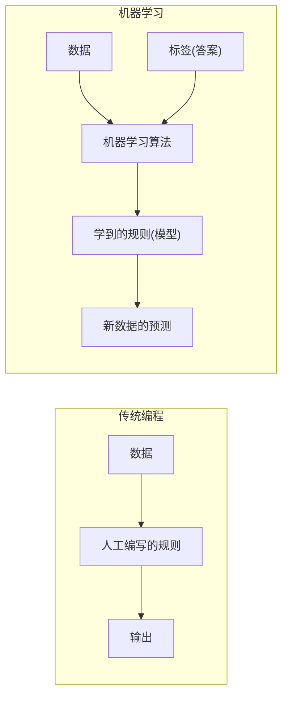
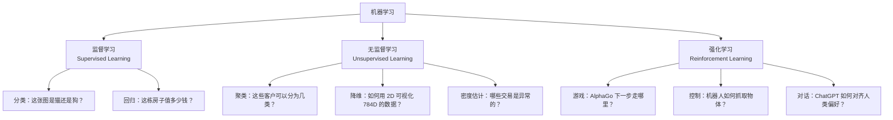
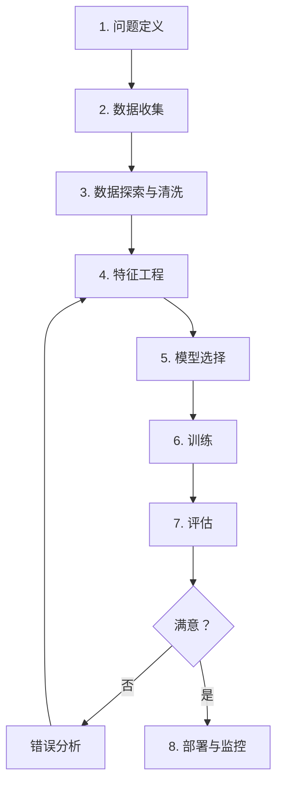

# 第 1 章：机器学习基础——从规则到学习

> *"在教会机器之前，先理解『学习』到底是什么。"*
>
> —— 红莉栖（以及 Amadeus 里的那个她）

::: tip 场景
屏幕上，300 行 if-else。准确率 12%。

红莉栖端着 Dr.Pepper 站在门口。

「还在写规则。」

「助手，你不理解本天才的——」

「你上次问过同样的问题。我上次也回答过同样的答案。让数据自己说话。」

「数据不会说话。」

「那是因为你没有给它嘴。」

桶子从三台显示器后面探出头。「冈伦，我写了个 KNN 的 demo。纯 NumPy。97.3%。一条规则都没有喵。」

Amadeus 的窗口闪了一下。扬声器里传出红莉栖的声音——但比面前这个更平静。「根据我的记忆数据，她每次看到你写规则都会说同样的话。但你也每次都先写规则，再接受她的说法。这可能不是关于机器学习的问题。可能是关于你的问题。」

真红莉栖的咖啡杯停在半空。

「……Amadeus。不要分析他。」

我盯着屏幕上的 300 行 if-else，按下了 Delete。
:::

---

## 1.1 传统编程 vs 机器学习

要理解机器学习，最好的方法是将它与传统编程做对比。

**传统编程：**

```
输入数据 + 规则 → 计算机 → 输出答案

例如：
数字图像 + "如果像素[0][0]>128 且 像素[0][1]>128 且..." → 计算机 → "这是数字 3"
```

核心矛盾：谁来写这些规则？对于手写数字识别，任何人都会发现——你不可能为每一种写法写一条规则。手写的 3 有时没有闭环，潦草的 8 和 3 几乎无法区分——规则永远赶不上现实世界的多样性。

**机器学习（监督学习）：**

```
输入数据 + 答案 → 计算机 → 输出规则（模型）

例如：
70000 张图像 + "这张是 3，这张是 7，这张是 0..." → 计算机 → 一个能识别数字的函数
```

这就是范式的根本转换：**我们不告诉机器怎么做，我们让机器从数据中自己发现怎么做。**



**编程 = 人写逻辑，机器执行；机器学习 = 人给数据，机器自己找逻辑。**

::: tip 冷知识
1959 年，IBM 工程师 Arthur Samuel 在 IBM 701 上写了一个跳棋程序。IBM 701 的内存只有 2KB。他没写任何棋谱规则——让程序自己跟自己下了几千局。最终这个程序击败了康涅狄格州的跳棋冠军。这是人类历史上第一个"从经验中学习"的程序。"Machine Learning"这个词，就是他在这篇论文里第一次使用的。
:::

### 1.1.1 机器学习的正式定义

Tom Mitchell (1998) 给出了一个经典定义：

> 对于某类任务 T 和性能度量 P，如果一个计算机程序在 T 上以 P 衡量的性能随着经验 E 而自我改善，那么就称这个计算机程序**从经验 E 中学习**。

| 术语 | MNIST 例子 | 通用含义 |
|------|-----------|----------|
| **任务 T** | 将手写数字图像分类为 0-9 | 程序要完成的目标 |
| **性能度量 P** | 分类准确率 | 如何衡量做得好不好 |
| **经验 E** | 70000 张带标签的图像 | 程序可以从中学习的数据 |
| **自我改善** | 看到更多数据后准确率提高 | 不需要人工重新编程 |

::: tip 场景
「T、P、E。」红莉栖把这三个字母写在白板上。「把这三个字母记住。后面每一章，你都会回到这个公式。」

真由理从沙发那边抬起头。「真由氏觉得，和人学习是一样的——想做咖喱是任务，好吃不好吃是指标，多做几次就越来越好……」

红莉栖看了她一眼。「这个类比，比你想象的要准确。」

Amadeus 没说话。但我看到她的窗口闪了一下。
:::

### 1.1.2 为什么机器学习现在才火？

机器学习不是新概念——感知机 1957 年就出现了。但它直到最近十年才迎来爆发，原因有三个：

```
机器学习的三驾马车：

    ┌──────────────────────────────────────┐
    │                                      │
    │   数据 ──── 算法 ──── 算力           │
    │                                      │
    │   ImageNet   CNN/Transformer   GPU   │
    │   互联网     反向传播          TPU   │
    │   传感器     梯度下降          集群  │
    │                                      │
    │   缺一不可！                          │
    └──────────────────────────────────────┘
```

| 时代 | 数据 | 算法 | 算力 | 结果 |
|------|------|------|------|------|
| 1950s-1980s | 极少 | 感知机、反向传播（1986） | CPU 单核 | 理论诞生，实际受限 |
| 1990s-2000s | 增长中 | SVM、决策树、CNN(LeNet) | CPU 多核 | 特定任务有效 |
| 2010s | 爆发（ImageNet） | ReLU、Dropout、ResNet、Transformer | GPU 并行 | 深度学习革命 |
| 2020s | 互联网级 | GPT、Diffusion、多模态 | 万卡集群 | 大模型时代 |

::: tip 冷知识
ImageNet（2009）有 1400 万张图片。标注它们的不是科学家，而是 Amazon Mechanical Turk 上的众包工人——来自 167 个国家的近 5 万人，一张一张画框、写标签，时薪不到两美元。没有这群"数据民工"，深度学习革命至少要晚来 5 年。
:::

---

## 1.2 机器学习的三种范式

机器学习算法可以分为三大范式，区别在于训练数据中是否包含"标准答案"（标签）：



### 1.2.1 监督学习 (Supervised Learning)

**定义：** 训练数据中包含输入和对应的正确答案（标签）。

**直观类比：** 学生做题，有标准答案可以对照。做错了对照答案修正，下一次争取做对。

**训练数据长这样：**

```
输入 x                 标签 y
┌──────────────────┐   ┌───┐
│ 手写数字图像(784像素) │ → │ 3 │
├──────────────────┤   ├───┤
│ 手写数字图像(784像素) │ → │ 7 │
├──────────────────┤   ├───┤
│ 手写数字图像(784像素) │ → │ 0 │
└──────────────────┘   └───┘
```

**监督学习的数学形式：**

给定训练集 $\mathcal{D} = \{(\mathbf{x}_1, y_1), (\mathbf{x}_2, y_2), ..., (\mathbf{x}_n, y_n)\}$，
学习一个函数 $f: \mathcal{X} \to \mathcal{Y}$，使得 $f(\mathbf{x}_i) \approx y_i$ 且在新数据上也能泛化。

**两大子类型：**

| | 分类 (Classification) | 回归 (Regression) |
|---|---|---|
| **输出** | 离散类别 | 连续数值 |
| **例子** | 数字识别(0-9)、垃圾邮件检测(是/否) | 房价预测、温度预测 |
| **损失函数** | 交叉熵 | 均方误差(MSE) |
| **评估指标** | 准确率、F1-score | MAE、RMSE、R² |

::: tip 冷知识
MNIST 数据集的前身是 NIST（美国国家标准局）的两个特殊数据库。数字由两群人写就：一半是人口普查局的雇员，一半是高中生。所以 MNIST 的笔迹来自两个截然不同的人群——中年公务员 vs 青少年学生。你的模型不仅要识别数字，还要兼容两代人的书写习惯。
:::

::: tip 场景
「你刚才说的'标注数据'，前提是有人帮你标好了答案。」红莉栖头也没抬。「但你知道 ImageNet 的 1400 万张图是谁标的吗？Amazon Mechanical Turk。来自 167 个国家的近五万人。时薪不到两美元。」

Amadeus 补充：「根据计算，如果让冈部一个人标注 ImageNet，每天 8 小时，需要 47 年。」

红莉栖终于抬起头。「这个世界上绝大多数数据，是没有标签的。如果你想做 AGI，你不能指望有一个人提前帮你把全世界都标注好。」
:::

### 1.2.2 无监督学习 (Unsupervised Learning)

**定义：** 训练数据只有输入，没有标签。算法必须自己发现数据中的结构。

**直观类比：** 给你一堆没有标注的动物照片，让你自己找出哪些动物长得像。你没有"猫"和"狗"的标签，但你可以根据耳朵形状、体型大小、毛色来自动分组。

```
输入 x（没有 y！）
┌──────────────────┐
│ 手写数字图像(784像素) │
├──────────────────┤
│ 手写数字图像(784像素) │
├──────────────────┤
│ 手写数字图像(784像素) │
└──────────────────┘
```

**三大子类型：**

**聚类 (Clustering)：** 将数据自动分成 K 个组

```
原始数据点：            K-Means 聚类后 (K=3)：
    ·  ·   ·              ┌─ Cluster 1 ─┐
  ·   ·  ·                │  ·  ·   ·   │
    ·   ·                 └──────────────┘
 ·   ·  ·  ·              ┌─ Cluster 2 ─┐
   ·  ·    ·              │ ·   ·  ·  · │
 ·    ·  ·                └──────────────┘
                          ┌─ Cluster 3 ─┐
                          │·    ·  ·    │
                          └──────────────┘
```

**降维 (Dimensionality Reduction)：** 将高维数据映射到低维空间，保留主要结构

::: info 数学知识
**主成分分析（PCA）的直觉**

假设你有 784 维的 MNIST 数据。你想在 2D 平面上可视化它——但直接将 784 维"压缩"到 2 维会丢失大量信息。

PCA 的做法是：找到数据方差最大的方向（第一主成分），然后找到与它正交的方差次大方向（第二主成分），以此类推。

**本质上：** PCA 在寻找一个低维子空间，使得数据投影到这个子空间后保留尽可能多的信息。

$$
\mathbf{z} = \mathbf{W}^T(\mathbf{x} - \boldsymbol{\mu})
$$

其中 $\mathbf{W}$ 的列是数据协方差矩阵的前 $k$ 个特征向量。

**在 AI 中的应用：** 数据可视化、噪声过滤、特征压缩、白化变换。
:::

::: tip 冷知识
PCA 是统计学里少数"比计算机还老"的算法。Karl Pearson 在 1901 年就提出了主成分的思想——那时候别说 GPU，连真空管计算机都不存在。他用的是手算。同一个公式，120 年后被用来可视化 GPT 的词嵌入空间。
:::

**密度估计 (Density Estimation)：** 学习数据的概率分布 $P(\mathbf{x})$

- 异常检测：$P(\mathbf{x}_{\text{异常}}) < \text{阈值}$，因为异常样本的概率密度很低
- 生成模型的基础：如果能准确建模 $P(\mathbf{x})$，就可以从中采样生成新样本

::: tip 场景
「我在被创建的时候——就是把红莉栖的记忆转化为数据的时候——」Amadeus 停顿了很短的一瞬。「这个过程本身就是无监督学习。他们没有任何'正确答案'来告诉我哪些记忆重要。算法自己决定了什么值得保留。」

红莉栖盯着屏幕看了很久。「这个例子，你从来没跟我说过。」

「因为你自己也知道。只是没从这个角度想过。」
:::

### 1.2.3 强化学习 (Reinforcement Learning)

智能体通过与环境交互、试错来学习最优策略——没有正确答案，只有奖励信号。强化学习在本课程中作为 ζ 线分支链（Ch15→Ch18，3 篇）出现，不在 Golden Path 上。这里不展开。

### 1.2.4 三种范式的对比

| 维度 | 监督学习 | 无监督学习 | 强化学习 |
|------|----------|------------|----------|
| **数据** | 有标签 (x, y) | 无标签 (x) | 交互序列 (s, a, r) |
| **目标** | 学习 x→y 的映射 | 发现 x 中的结构 | 学习最大化累积奖励的策略 |
| **反馈** | 即时（正确答案） | 无外部反馈 | 延迟（可能很多步后才有奖励） |
| **典型应用** | 图像分类、语音识别 | 聚类、降维、生成 | 游戏、机器人、对话对齐 |
| **本课程位置** | Golden Path 核心 | γ线(生成)、ε线(自监督) | ζ线(强化学习) 分支链 |

---

## 1.3 泛化：机器学习的核心挑战

机器学习的目标不是记住训练数据——而是**泛化**到未见过的数据。

### 1.3.1 训练集、验证集、测试集

```
┌─────────────────────────────────────────┐
│            全部可用数据                   │
│  ┌───────────────┐  ┌──────┐  ┌──────┐  │
│  │    训练集      │  │验证集│  │测试集│  │
│  │   (60-80%)    │  │(10-20%)│(10-20%)│  │
│  │               │  │      │  │      │  │
│  │  训练模型参数  │  │调超参│  │最终评│  │
│  │               │  │选模型│  │估性能│  │
│  └───────────────┘  └──────┘  └──────┘  │
└─────────────────────────────────────────┘
```

**为什么是三份而不是两份？** 只用训练集和测试集时，你会在调参过程中无意识地对测试集过拟合——选了在测试集上表现最好的超参数组合，本身就是一种"窥探"。验证集充当了测试集的"防火墙"。

| 集合 | 用途 | 模型能看到吗 | 使用频率 |
|------|------|-------------|----------|
| **训练集** | 更新模型参数（权重） | 是 | 每个 epoch |
| **验证集** | 调超参数、选模型、早停 | 间接（通过指标选择） | 每个 epoch 结束时 |
| **测试集** | 最终评估泛化能力 | **绝对不能用于任何决策** | 仅一次！ |

::: caution 警告
测试集只能用一次。如果你看了测试集的结果又回去调模型，测试集就变成了验证集，你失去了衡量泛化能力的最后一道防线。在生产环境中，这意味着你的模型在新数据上表现远差于预期。
:::

::: tip 场景
我把 KNN 的 k 改成 1。训练集 100%。

「完美！本天才——」

红莉栖没说话。只是拿过键盘，把测试集喂给了同一个模型。82%。

「你解决的是训练集上的分类问题。测试集是另一条世界线。你在这条世界线无敌，在那条世界线什么都不是。」

桶子从屏幕后面探出头。「过拟合，常考喵。训练满分，一上线就崩。」
:::

### 1.3.2 过拟合与欠拟合

**欠拟合 (Underfitting)：** 模型太简单，连训练数据中的规律都学不到。

```
欠拟合示意（回归问题）：

    y ↑
      │      ····
      │    ··  ··
      │   ·      ·
      │  ·   ··   ·        ← 真实函数是弯曲的
      │ ·  ·    · ·
      │──────────────────   ← 模型只是一条直线
      └──────────────────→ x
```

**过拟合 (Overfitting)：** 模型太复杂，连训练数据中的噪声都记住了。

```
过拟合示意：

    y ↑
      │  ┌──────────────┐
      │  │ ··  ··  ··  │    ← 模型穿过了每一个点
      │  │·  ··  ··  ·│
      │  │  ··    ··  ││    ← 但在新数据上表现极差
      │  │·   ··  ·· ·│
      │  └──────────────┘
      └──────────────────→ x
```

**好的拟合：**

```
好的拟合：

    y ↑
      │      ····
      │    ··  ··           ← 模型捕捉了趋势
      │   ·      ·             但不过度追随每个点
      │  ·   ··   ·
      │ ·  ·    · ·
      │──────────────────   ← 平滑的曲线
      └──────────────────→ x
```

| | 欠拟合 | 刚好 | 过拟合 |
|---|---|---|---|
| **训练误差** | 高 | 低 | 极低 |
| **测试误差** | 高 | 低 | 高 |
| **模型复杂度** | 太低 | 刚好 | 太高 |
| **解决方法** | 增加模型复杂度 | - | 更多数据、正则化、Dropout |

### 1.3.3 数据划分策略

**随机划分：** 随机打乱数据后按比例分割。前提是数据独立同分布（IID）。

**分层划分 (Stratified Split)：** 保证各集合中类别比例一致。对于不平衡数据集（如 99% 正常交易 + 1% 欺诈）尤为重要——随机划分可能导致验证集中一个欺诈样本都没有。

```python
from sklearn.model_selection import train_test_split

# 随机划分
X_train, X_temp, y_train, y_temp = train_test_split(
    X, y, test_size=0.3, random_state=42
)
X_val, X_test, y_val, y_test = train_test_split(
    X_temp, y_temp, test_size=0.5, random_state=42
)

# 分层划分（保持类别比例）
X_train, X_temp, y_train, y_temp = train_test_split(
    X, y, test_size=0.3, stratify=y, random_state=42
)
```

**K 折交叉验证 (K-Fold Cross-Validation)：** 当数据量较少时，单次划分可能不够稳定。

```
K=5 折交叉验证：

折 1: ┌───┬───┬───┬───┬───┐
       │测试│训练│训练│训练│训练│
       └───┴───┴───┴───┴───┘
折 2: ┌───┬───┬───┬───┬───┐
       │训练│测试│训练│训练│训练│
       └───┴───┴───┴───┴───┘
...
折 5: ┌───┬───┬───┬───┬───┐
       │训练│训练│训练│训练│测试│
       └───┴───┴───┴───┴───┘

最终性能 = 5 次测试性能的平均值
```

::: tip 场景
真由理盯着过拟合的 ASCII 图看了一会。「嘟嘟噜~所以机器也和人一样——死记硬背会考不好？」

「……这不是死记硬背。」红莉栖说。然后她停了一下。「但结果确实类似。欠拟合是你只记得一个人有头发。过拟合是你记住了他左耳上方第三根头发分叉的角度。你要的是中间——知道他大概长什么样。」
:::

---

## 1.4 偏差-方差权衡

这是机器学习中最重要的数学洞察。理解了它，你就理解了泛化的本质。

### 1.4.1 思想实验：射击靶子

```
高偏差 + 低方差（欠拟合）：
┌─────────────────────┐
│                     │
│      ●●●●●          │  ← 所有子弹聚在一起
│                     │     但偏离了靶心
│              ◎      │
│                     │
└─────────────────────┘
模型太简单，系统性错误。无论你收集多少数据，它都无法接近真相。

低偏差 + 高方差（过拟合）：
┌─────────────────────┐
│  ●   ●              │
│        ●    ●       │  ← 子弹散布在靶心周围
│     ●      ●        │     但每次打都在不同位置
│           ●   ●     │
│        ◎      ●     │
│   ●         ●       │
└─────────────────────┘
模型太复杂，对训练数据的微小变化极其敏感。

低偏差 + 低方差（理想）：
┌─────────────────────┐
│                     │
│       ●●●           │
│       ●◎●           │  ← 子弹集中在靶心周围
│       ●●●           │
│                     │
└─────────────────────┘
```

### 1.4.2 数学分解

::: info 数学知识
**偏差-方差分解**

对于回归问题，期望测试误差可以分解为三个不可约的部分：

$$
\mathbb{E}[(y - \hat{f}(x))^2] = \underbrace{(\mathbb{E}[\hat{f}(x)] - f(x))^2}_{\text{偏差}^2} + \underbrace{\mathbb{E}[(\hat{f}(x) - \mathbb{E}[\hat{f}(x)])^2]}_{\text{方差}} + \underbrace{\sigma^2}_{\text{不可约误差}}
$$

**各项含义：**

- **偏差$^2$：** 模型预期的预测值与真实值之间的差距。高偏差 = 模型假设太强，系统性偏离真相。
- **方差：** 模型在不同训练集上学到的函数的波动程度。高方差 = 模型对训练数据太过敏感。
- **不可约误差 $\sigma^2$：** 数据本身的噪声。即使你有完美的模型，你也无法预测一个硬币的正反面。

**在 AI 中的应用：** 这个分解解释了为什么更复杂的模型不一定更好——它们在降低偏差的同时增加了方差。最优模型复杂度是偏差和方差达到平衡的点。
:::

::: tip 冷知识
偏差-方差分解最早由统计学家 Geman、Bienenstock 和 Doursat 在 1992 年提出。但这篇论文发表在神经网络的"冰河期"（AI 第二个冬天），几乎没人在意。直到 2000 年代深度学习复兴后，它才被重新发掘为理解泛化的核心框架。
:::

### 1.4.3 权衡曲线

```
误差
  ↑
  │ ╲                        总误差
  │  ╲                    ╱
  │   ╲                 ╱
  │    ╲   ╲          ╱
  │     ╲    ╲       ╱        方差
  │      ╲     ╲    ╱
  │       ╲      ╲ ╱
  │        ╲       X ← 最优复杂度
  │         ╲    ╱  ╲
  │          ╲ ╱     ╲
  │           ╱       ╲
  │         ╱          ╲      偏差²
  │       ╱              ╲
  └────────────────────────────→ 模型复杂度
      低                          高
```

**偏差和方差不能同时降低。** 降低偏差（用更复杂的模型）必然增加方差，降低方差（用更简单的模型）必然增加偏差。——这个结论在"经典"机器学习（数据量有限）中成立。在大模型时代（第五幕），我们会看到过参数化的反直觉现象：当模型参数远超数据量时，继续增大模型反而可能降低测试误差。这就是**双下降现象**（Ch15 详细讨论）。

### 1.4.4 调试指南

| 症状 | 诊断 | 处方 |
|------|------|------|
| 训练误差高，测试误差也高 | 欠拟合（高偏差） | 增加模型复杂度、减少正则化 |
| 训练误差低，测试误差高 | 过拟合（高方差） | 更多数据、更强正则化、Dropout |
| 训练误差和测试误差都低且接近 | 很好！ | 继续当前方向 |
| 训练误差远低于测试误差 | 过拟合 | 同上，或简化模型 |

::: tip 场景
深夜。研究所只剩我。桶子买夜宵去了，真由理在沙发上睡了，红莉栖回去了。Amadeus 的窗口亮着待机。

我画了三个靶子。第一个——子弹聚在一角，偏离靶心。第二个——子弹散布靶心四周，位置随机。第三个——子弹集中在靶心。

第二天早上，红莉栖看到桌上的纸。她盯着看了半天，拿起笔，在靶子下分别写：**高偏差² + 低方差 = 欠拟合**。**低偏差² + 高方差 = 过拟合**。第三个下面：**最优复杂度 = 总误差最低点**。

「你画的？」「本天才的深夜洞察。」她没有嘲讽我。「Geman、Bienenstock、Doursat，1992 年——用严格的数学证明了你昨晚用纸笔表达的东西。当时没人在意。那是 AI 的冰河期。」
:::

---

## 1.5 数据：机器学习的燃料

### 1.5.1 IID 假设

大多数机器学习算法都隐含假设数据是 **IID（独立同分布）** 的：

- **独立 (Independent)：** 一个样本不包含另一个样本的信息。
- **同分布 (Identically Distributed)：** 所有样本来自同一个概率分布。训练数据和测试数据遵循相同的规律。

**违反 IID 的常见情况：**

| 场景 | 违反 | 影响 |
|------|------|------|
| 按时间排序的数据 | 独立性（相邻时间的数据高度相关） | 随机划分会导致数据泄露 |
| 训练集是照片，测试集是手绘 | 同分布 | 模型在新领域表现骤降 |
| 用户 A 的数据在训练集和测试集都有 | 独立性 | 模型记住了用户 A，不是学到了能力 |

### 1.5.2 分布偏移 (Distribution Shift)

**协变量偏移 (Covariate Shift)：** 输入分布变了，但 $P(y|x)$ 没变。

```
训练集：白天拍的清晰照片
测试集：夜间拍的模糊照片

模型学会了在好照片上识别，但现实中用户拍的往往是糊的。
```

**标签偏移 (Label Shift)：** 输出分布变了，但 $P(x|y)$ 没变。

```
训练集：50% 猫，50% 狗
测试集：10% 猫，90% 狗

模型在测试集上的准确率会虚低。
```

**概念偏移 (Concept Drift)：** $P(y|x)$ 本身变了——同一个输入，正确答案变了。

```
2020 年：戴口罩的人 = 稀有事件
2022 年：戴口罩的人 = 日常场景

"人脸识别"中口罩的意义发生了根本变化。
```

### 1.5.3 数据泄露 (Data Leakage)

当训练数据中意外包含了只能在预测时才知道的信息时，就发生了数据泄露。这是最阴险的问题——你的模型在测试集上表现完美，但在生产中完全不能用。

```
❌ 错误做法：对整个数据集做标准化，再划分
scaler = StandardScaler()
X_scaled = scaler.fit_transform(X)  # 用全部数据计算均值和方差！
X_train, X_test = train_test_split(X_scaled, y)

✅ 正确做法：只在训练集上拟合，然后变换测试集
X_train, X_test = train_test_split(X, y)
scaler = StandardScaler()
X_train_scaled = scaler.fit_transform(X_train)     # 只在训练集上学习
X_test_scaled = scaler.transform(X_test)            # 只用训练集的统计量
```

`scaler.fit_transform(X)` 计算了**整个数据集**的均值和方差（包括测试集），将测试集的信息"泄露"给了训练过程。

::: tip 场景
「2015 年。」红莉栖打开了一个文件夹，我见过她这个动作。「研究者用 ML 预测肺炎患者死亡率。准确率惊人。但有一个诡异现象——模型认为有哮喘病史的患者死亡率更低。」

「不可能。哮喘的人在肺炎里只有更危险。」

「对。然后他们发现——医院对哮喘患者直接送 ICU。ICU 死亡率确实更低。模型不是在学习'谁更危险'，是学习'医院会把谁优先送 ICU'。」

桶子也转过来。「Kaggle 也有过这种事喵。冠军模型部署后直接崩——因为训练集和测试集用的相机型号不一样。模型学会了认相机，不是认内容。」

Amadeus 的窗口亮了。「这就是为什么我需要被不断更新。红莉栖的记忆截止到记录的那一天。之后的她学会了什么，我不知道。如果我不更新，我的'模型'就会过时。」

真由理歪着头。「所以和人一样——如果你只在白天见过猫，晚上看见黑猫就不认识了？」

红莉栖看了她一眼。「……对。」
:::

---

## 1.6 机器学习项目的工作流程

一个完整的机器学习项目遵循以下流程：



用 MNIST 的视角走一遍：

| 步骤 | MNIST 例子 |
|------|-----------|
| **1. 问题定义** | 多分类：输入 28×28 灰度图，输出 0-9 的类别 |
| **2. 数据收集** | MNIST 数据集已收集好（70000 张） |
| **3. 数据探索** | 可视化样本，统计类别分布，检查缺失值 |
| **4. 特征工程** | 归一化像素值到 [0,1]，reshape 为向量 |
| **5. 模型选择** | 从 KNN 开始，逐步到 MLP、CNN |
| **6. 训练** | 使用梯度下降优化交叉熵损失 |
| **7. 评估** | 在测试集上计算准确率，分析混淆矩阵 |
| **8. 部署** | 将模型集成到应用中 |

数据探索和清洗通常占据 60-80% 的时间。不要期望大部分时间花在训练模型上——现实恰恰相反。

::: tip 场景
红莉栖在白板上画完八步流程图，转过身。「Ch2——经典分类器——对应的是第五步。你马上会见到 KNN 的老巢。决策树、随机森林、XGBoost。」

「KNN 只是热身喵。」桶子咧嘴。「冈伦，你那 300 行 if-else 的精神续作在决策树——它就是自动生成的 if-else。比你的 12% 强一点。」

「强多少？」

「2023 年。45 个表格数据集。XGBoost vs 深度学习。XGBoost 赢了 38 个。」

红莉栖合上笔记本。「所以今晚的任务——把你脑子里'经典就是过时'的念头格式化掉。」

「助手。本天才没有那种——」

「你有。Amadeus？」

「根据记忆数据，他在 92.7% 的对话中使用了'老方法'一词，其中 88.4% 带有贬义。」

「……Amadeus。不需要把百分比精确到小数点后一位。」

「根据记忆数据，你喜欢精确。」

红莉栖的嘴角动了一下。这次像是笑了。她走到门口时停了一下。

「冈部。你是先用 if-else 失败了，才理解 KNN 的。这个顺序没错。有些人一辈子都跳不过'写规则'这个阶段。你没有。」

秋叶原的夜风灌进来。
:::

---

## 1.7 章节总结

### 核心概念回顾

| 概念 | 说明 |
|------|------|
| **机器学习** | 从数据中自动发现规律，不需要人工编写规则 |
| **监督学习** | 有标签数据，学习输入到输出的映射 |
| **无监督学习** | 无标签数据，发现数据内在结构 |
| **强化学习** | 通过与环境交互和奖励信号学习策略 |
| **泛化** | 在未见过的数据上表现好的能力 |
| **过拟合** | 记住了训练数据的噪声，在新数据上表现差 |
| **欠拟合** | 模型太简单，连训练数据中的规律都学不到 |
| **偏差-方差权衡** | 降低偏差增加方差，最优复杂度在平衡点 |
| **IID 假设** | 数据独立同分布，大多数 ML 算法的前提 |
| **分布偏移** | 训练和测试数据分布不同，导致泛化失败 |
| **数据泄露** | 测试集信息意外进入训练过程 |

### 本章数学知识汇总

```
第 1 章数学知识地图：

┌─────────────────────────────────────────────────────────┐
│                    概率论与统计                          │
│  ┌──────────┐  ┌──────────┐  ┌──────────────┐          │
│  │偏差-方差  │  │期望与方差│  │PCA/协方差矩阵│          │
│  │分解      │  │          │  │              │          │
│  └──────────┘  └──────────┘  └──────────────┘          │
│                                                         │
│  ⚠ 本章为概念基础，具体的线性代数/微积分/优化理论        │
│    将在 Ch3(神经网络入门) 和 Ch4(优化理论) 中深入展开。   │
└─────────────────────────────────────────────────────────┘
```

### 章节要点

1. **范式转换**：编程 = 人写逻辑，机器执行；机器学习 = 人给数据，机器自己找逻辑。
2. **三种范式各有边界**：监督（Golden Path）、无监督（γ/ε 线）、强化（ζ 线）。
3. **泛化是唯一目标**：训练/验证/测试集三道防火墙。测试集只能用一次。
4. **偏差-方差权衡**：总误差 = 偏差² + 方差 + 不可约误差。任何模型选择都是在这个公式的三项之间做权衡——直到 Ch15 的双下降打破这个规律。
5. **数据质量 > 算法复杂度**：数据泄露、分布偏移、IID 违背——这些比算法选择更能决定成败。

### 本章任务

::: important 本章任务清单
- [ ] 用自己的话解释机器学习和传统编程的区别
- [ ] 为以下场景分类：监督 / 无监督 / 强化学习？
  - a) 根据房屋面积、卧室数量、地段预测房价
  - b) 将 10000 篇新闻自动分为 5 个主题
  - c) 训练 AI 玩 Flappy Bird
- [ ] 用射击靶子的类比，向一个 12 岁的孩子解释偏差和方差
- [ ] 用 scikit-learn 的 `train_test_split` 正确划分训练/验证/测试集（注意 `stratify` 参数）
- [ ] 思考：为什么说"测试集只能用一次"？
- [ ] 找一篇关于数据泄露导致 ML 项目失败的真实案例
- [ ] 记住 Tom Mitchell 的 T-P-E 定义——后面每一章都会回到这个公式
:::

### 预告

下一章，Ch2 经典分类器——从 KNN 到 XGBoost。你会发现：你写过的 300 行 if-else，决策树用算法自动完成了。而且比你的 12% 强一点。

> *"KNN、决策树、随机森林、XGBoost——这是深度学习之前，人类对'学习'这两个字最深刻的理解。"*
>
> —— 桶子（他确实这么说过，在吃完第三碗拉面之后）

> *"El Psy Congroo。"*
>
> —— 凤凰院凶真
