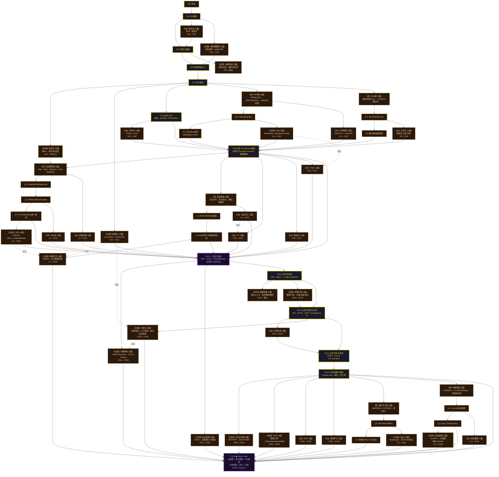

# Amadeus Gate：命运石之门 —— 大纲 v4

> 主线 = 金色路径（最小必读）。分支链 = 可选深度探索（可单篇可多篇，链内可再分叉）。

---

## 阅读约定

| 图例 | 含义 |
|------|------|
| 金色粗线 | **主线 (Golden Path)** —— 最小必读路径 |
| α(青)/β(紫)/γ(绿)/δ(金) | **平行世界线** —— 可选分支链，与主线并行 |
| 橙色虚线 | **分支** —— 单篇或链式，完成后汇入 |
| 紫色双层 | **收束点** —— 多路径汇聚 |
| 橙色虚线箭头 | **交叉连接** —— 分支之间可以互跳 |

---

## 主线 (Golden Path)

> 如果你只想走最少的路理解 ML 全貌，只读这些。

```
Ch0 → Ch1 → Ch2 → Ch3 → Ch4 → Ch5 → Ch8 → Ch11 → Ch12 → Ch13 → Ch14 → Ch15 → Ch18
(13章)
```

- Ch5(CNN) 被选为推荐的视觉路线，因为 CNN 是理解后续架构的基础
- RNN(Ch6)、GNN(Ch7) 降为分支链——你可以从 Ch4 后拐进去
- 生成模型(Ch9)、自监督(Ch10)、RL(Ch16)、多模态(Ch17) 全部降为分支链

---

## DAG 全图



---

## 主线 (Golden Path) 定义

> 最小必读路径，13 章。走完就能理解 ML 全貌。

| # | 章节 | 累积基础 |
|---|------|----------|
| 0 | 序章 | - |
| 1 | ML基础 | 三范式、偏差-方差 |
| 2 | 经典分类器 | KNN、树、集成 |
| 3 | 神经网络入门 | MLP、反向传播 |
| 4 | 优化理论 | SGD→AdamW、正则化 |
| 5 | CNN | 卷积→ResNet |
| 8 | Transformer基础 | Encoder-Decoder |
| 11 | 注意力收束 ⚡ | QKV、FlashAttention、全谱系 |
| 12 | 预训练 | GPT、BERT、LLaMA |
| 13 | 后训练与对齐 | SFT、RLHF、DPO |
| 14 | 评估与基准 | MMLU、Arena Elo |
| 15 | 规模化涌现 | Scaling Law、涌现 |
| 18 | Steins Gate ◆ | AGI路径、对齐、可控 |

---

## 分支链目录

> 每个分支链可以是 **1-N 篇文章**。链内可以有自己的子分支。标注 "(N篇)"。

### 早期分支 (Ch1-4)

| 分支链 | 入口 | 汇入 | 篇数 | 内容 |
|--------|------|------|------|------|
| 核方法 | Ch1 | Ch2 | 1 | SVM深度、核技巧、RKHS |
| 概率图模型 | Ch1 | Ch3 | 2 | ①贝叶斯网 ②HMM/CRF |
| 推荐系统 | Ch2 | 独立 | 2 | ①协同过滤→双塔 ②MMOE→工业实践 |
| 信息论 | Ch4 | γ线入口 | 2 | ①熵/KL/互信息 ②率失真/信道容量 |
| 因果ML | Ch4 | Ch11 | 2 | ①do-calculus/Pearl阶梯 ②Double ML/因果发现 |

### 平行世界线 (Ch4后分叉)

| 分支链 | 入口 | 汇入 | 篇数 | 内容 | 子分支 |
|--------|------|------|------|------|--------|
| **β线: RNN** | Ch4 | Ch8 | 3 | ①RNN/LSTM ②GRU/Seq2Seq ③Attention起源 | Mamba(②→Ch8)、时序预测(①→Ch8) |
| **δ线: GNN** | Ch4 | Ch8 | 3 | ①消息传递/GCN ②GAT/GIN/WL-test ③图应用 | 几何DL(②→Ch8) |

### 交汇期分支 (Ch8后分叉)

| 分支链 | 入口 | 汇入 | 篇数 | 内容 | 子分支 |
|--------|------|------|------|------|--------|
| 对抗ML | Ch5 | Ch8 | 1 | FGSM→PGD→对抗训练→LLM越狱 | - |
| ViT | Ch8 | Ch11 | 1 | ViT→Swin→DeiT→DINOv2 | - |
| 音频ML | Ch8 | Ch11 | 1 | Whisper→HuBERT→Wav2Vec | - |
| Titans | Ch8 | Ch11 | 1 | 长期记忆→惊喜度量→adaptive forgetting | - |
| **γ线: 生成模型** | Ch8 | Ch11 | 4 | ①VAE/β-VAE ②GAN/WGAN/StyleGAN ③Diffusion/Score-based ④Flow Matching/统一视角 | 自编码器(①→Ch11)、3D生成(③→Ch11)、JEPA(④→Ch11) |
| **ε线: 自监督** | Ch8 | Ch11 | 3 | ①SimCLR/MoCo/InfoNCE ②BYOL/DINO/自蒸馏 ③MAE/BEiT/多模态预训练 | 对比深入(①→Ch11)、神经符号(③→Ch18) |

### 收束后分支 (Ch11后分叉)

| 分支链 | 入口 | 汇入 | 篇数 | 内容 |
|--------|------|------|------|------|
| 机制可解释性 | Ch11 | Ch18 | 2 | ①SAE/Transcoder ②Circuit Tracing/Anthropic解密 |
| 知识蒸馏 | Ch11 | Ch18 | 2 | ①Hinton/FitNet ②自蒸馏/数据集蒸馏/LLM蒸馏 |

### 大模型分支 (Ch12-15)

| 分支链 | 入口 | 汇入 | 篇数 | 内容 |
|--------|------|------|------|------|
| 推理与部署 | Ch12 | 独立 | 2 | ①量化/vLLM/KV Cache ②投机解码/硬件/边缘 |
| 数据工程 | Ch12 | Ch13 | 2 | ①数据飞轮/合成数据 ②去重(MinHash)/配比/污染 |
| 开源生态 | Ch13 | Ch14 | 1 | HF生态/许可证/Open Weights vs API |
| AI安全深度 | Ch13 | Ch18 | 3 | ①涌现错位/模型有机体 ②CoT监控/"最禁忌技术" ③前沿安全框架/红队 |
| 分布式训练 | Ch15 | Ch18 | 2 | ①DP/TP/PP ②ZeRO/FSDP/通信优化 |
| MoE | Ch15 | Ch18 | 2 | ①稀疏门控/Switch ②Mixtral/DeepSeekMoE/负载均衡 |
| NAS | Ch15 | Ch18 | 1 | ENAS→DARTS→ProxylessNAS→Once-for-All |
| 联邦学习 | Ch15 | Ch18 | 1 | FedAvg→差分隐私→安全聚合→联邦LLM |

### 终章分支 (Ch15后分叉)

| 分支链 | 入口 | 汇入 | 篇数 | 内容 | 子分支 |
|--------|------|------|------|------|--------|
| **ζ线: 强化学习** | Ch15 | Ch18 | 3 | ①MDP/DQN ②PPO/SAC/GRPO ③离线RL/RL+LLM交叉 | Agent(②→Ch18) |
| **η线: 多模态** | Ch15 | Ch18 | 3 | ①CLIP/BLIP/Q-Former ②LLaVA/指令微调 ③DALL-E3/SD3/Sora | 视频理解(②→Ch18)、具身智能(③→Ch18) |

---

## 交叉连接

> 分支与分支之间可以互跳。这些连接在文章中通过 `::: tip 交叉连接` 块标注。

| 从 | 到 | 理由 |
|----|-----|------|
| 对比学习深入(ε-1) | ViT | DINO 用 ViT 做对比自蒸馏 |
| Mamba/SSM | Titans | 两者都是 Attention 替代方案 |
| 因果ML | AI安全 | 因果盲症是错位/幻觉的根因 |
| JEPA | 神经符号AI | RiJEPA = JEPA + 符号逻辑 |
| AI安全 | 机制可解释性 | SAE 是检测错位的工具 |
| 知识蒸馏 | 推理部署 | 蒸馏模型是部署优化的前置 |

---

## 统计

| 类型 | 数量 | 说明 |
|------|------|------|
| 主线 (Golden Path) | **13 章** | 最小必读 |
| 分支链 | **20 条** | 其中 12 条多篇(2-4篇)，8 条单篇 |
| 分支链内子分支 | **9 条** | 从分支链中途分叉 |
| 分支文章总数 | **~55 篇** | 全部主线+分支+子分支 |
| 交叉连接 | **6 条** | 分支间互跳 |
| 收束点 | **2 个** | Ch11(注意力) + Ch18(Steins Gate) |

---

## 阅读路径示例


---

## 与 v3 的核心差异

| v3 | v4 |
|----|----|
| 19章主线，读者不知道怎么走 | **13章 Golden Path** 清晰标注 |
| 每分支 = 1篇文章 | 分支链 = **1-4篇**，链内可再分叉 |
| 分支之间无连接 | **6条交叉连接**，分支间可互跳 |
| Ch5/6/7都是主线 | 只有 **Ch5(CNN) 是主线**，RNN/GNN降为分支链 |
| Ch9/10/16/17是主线 | **全部降为分支链**，主线更精简 |
| 分支全从主线出 | 分支可从**分支链中途**分叉 |
