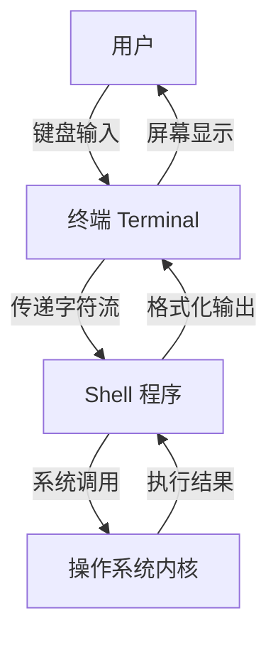
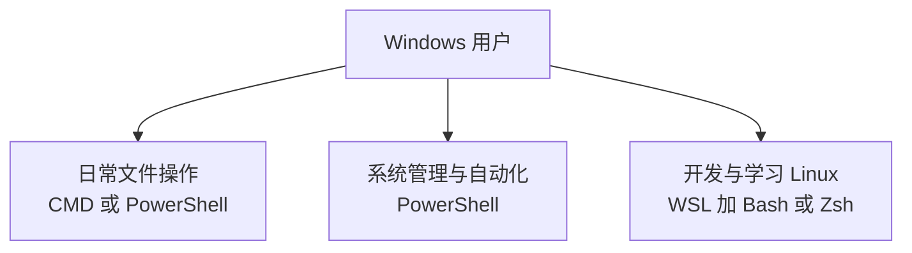

# 第 5 章：Shell 的世界

::: tip 本章目标
理解什么是 Shell，认识 CMD、PowerShell、Bash 等主流 Shell 的历史和特点，学会在不同环境下选择合适的 Shell，并开始个性化你自己的命令行环境。
:::

## 一、什么是 Shell？

你可能已经注意到，我们一直在说"命令行""终端""Shell"这些词。它们不是同义词。把概念理清楚，后续的交流才能建立在共同的词汇表上。

### 1.1 终端（Terminal）

**终端**是你看到的那个窗口——一个可以显示文字、接收键盘输入的界面程序。

在第 1 章我们追溯过终端的历史：从 1960 年代的电传打字机（TTY），到 1978 年 DEC 公司的 VT100 视频终端，再到今天的软件终端模拟器。终端的工作是处理输入和显示的物理层面——字体渲染、窗口管理、键盘事件、颜色输出。

常见的终端程序：
- **Windows**：Windows Terminal（推荐）、ConHost（系统自带）
- **macOS**：Terminal.app（系统自带）、iTerm2
- **Linux**：GNOME Terminal、Konsole、Alacritty、Kitty

### 1.2 Shell

**Shell**是运行在终端里的程序。它不负责显示文字，它负责理解文字。

更精确地说：Shell 是操作系统架构中的一个层。操作系统的核心是**内核（Kernel）**——它管理 CPU、内存、硬盘、网络等硬件资源，运行在最高权限级别，直接与物理硬件对话。Shell 是包裹在内核外面的一层"外壳"——它接收用户的文字指令，将其解析为系统调用，交给内核执行，然后把执行结果格式化后返回给用户。

这个名字是刻意的。"Shell"在英文中的字面意思就是"壳"。内核是种子最里面的部分，负责生命的基本功能；外壳是种子最外层的部分，负责与外部世界交互。内核处理最核心、最危险的工作——内存分配、进程调度、设备驱动。Shell 提供一个安全的外层界面，让人类用文字与内核对话。

这个架构设计的精妙之处在于：**内核只有一种，Shell 可以有很多种。** 一个 Linux 内核之上，你可以选择 Bash、Zsh、Fish 或任何兼容的 Shell 作为交互界面。不同的 Shell 提供不同的交互体验——有的语法严谨，有的自动补全强大，有的开箱即用，有的高度可定制。但它们的本质工作一致：将人类可读的文字指令转化为机器可执行的系统调用。

### 1.3 终端与 Shell 的关系

一张图胜过千言万语：



你可以把终端想象成电话的听筒和话筒——负责声音的输入和输出。Shell 是电话另一端和你对话的人——理解你的话，做出回应。换一个人接电话（换一个 Shell），交流风格会不同，但电话设备（终端）不需要更换。

这解释了为什么你可以在同一个终端窗口里切换 Shell：终端只是一个容器，里面运行什么 Shell 程序是独立的。打开终端，默认启动 Bash，输入 `zsh` 切换到 Zsh，再输入 `exit` 回到 Bash——终端窗口一直在那里，变的只是里面运行的程序。这个"容器和内容分离"的设计，是 Unix 分层的另一个体现。

## 二、Shell 家族的故事

今天的 Shell 格局是 50 年演化史的沉积层。理解这段历史的目的不在于考试——在于让你明白：为什么 Bash 的语法长这样、为什么 macOS 从 Bash 换成了 Zsh、为什么有些命令在 Linux 上能用而在 Windows 上不行。答案都在历史里。

### 2.1 Unix Shell：起点（1971）

Unix 诞生后不久，贝尔实验室的 Ken Thompson 就开发了第一个 Unix Shell，简称为 **sh**。

Thompson 的 Shell 是一个极度精简的程序，但它定义了后续所有 Unix Shell 的基本语法框架：
- 命令通过空格分隔参数
- 用 `|` 做管道（1973 年在 Unix 第三版中加入，第 4 章详细讨论了它的起源）
- 用 `>` 和 `<` 做重定向
- 用 `&` 在后台运行命令
- 用 `*`、`?`、`[...]` 做文件名通配（globbing）

这些设计至今仍是命令行的通用语言。今天你输入 `ls -l *.txt | grep hello`，其中的每一个符号——空格、`-l`、`*`、`|`——都来自 1971 年的那个原始 Shell。55 年了，语法没变过。向后兼容到这个程度，在软件行业极其罕见。

### 2.2 Bourne Shell：Shell 编程的诞生（1979）

::: info Stephen Bourne 与 Bourne Shell
Stephen Bourne 在贝尔实验室重新设计了 Unix Shell，这就是著名的 **Bourne Shell（sh）**。1979 年随 Unix 第七版一同发布。

Bourne Shell 做出的关键贡献不是改进了交互体验——它把 Shell 从"命令行工具"升级为"编程环境"。它引入了：
- `if`/`then`/`else`/`elif`/`fi` 条件判断结构
- `for`/`do`/`done` 和 `while`/`until` 循环结构
- `case` 模式匹配
- 变量赋值、引用与导出（`export`）
- 函数定义与调用

在此之前，Shell 只能逐条执行命令。在此之后，Shell 可以写程序——有分支、有循环、有变量、有函数。今天你写 Bash 脚本时使用的 `if [ -f "$file" ]; then ... fi` 语法，直接继承自 Bourne 在 1979 年的设计。几乎没有改动。

几乎所有现代 Unix Shell——Bash、Zsh、Ksh、Dash——都是 Bourne Shell 的后代。sh 不是历史上第一个 Unix Shell，但它是定义了"Shell 脚本"这个概念的那一个。
:::

### 2.3 Bash：一个双关语的诞生（1989）

1983 年，Richard Stallman 发起了 GNU 项目，目标是用自由软件重建一个完整的 Unix 兼容系统。到 1980 年代末，GNU 几乎拥有了操作系统的所有关键组件——编译器（GCC）、编辑器（Emacs）、核心工具集（coreutils）——唯独缺少一个 Shell。

::: note "Bourne Again"：一个精心设计的双关
1989 年，GNU 项目的 Brian Fox 开发了 **Bash**——全称 **Bourne Again Shell**。

这个名字是程序员幽默的一个经典案例。它在两个层面上同时成立：
1. **技术层面**：Bash 是 Bourne Shell 的"again"——又一个 Bourne Shell 的实现，兼容器
2. **语言层面**："Bourne Again"的发音与"Born Again"（重生）完全相同——Bourne Shell 在自由软件运动中获得了新生

一个软件的名字同时包含了"兼容声明"和"意识形态宣言"，还在读音上玩了一个梗。命名这门手艺，在开源社区里一直有这种传统——详见 2.4 节的 Shebang 故事。
:::

Bash 在 Bourne Shell 的基础上增加了丰富的交互功能：
- 命令行历史（按 ↑ 浏览之前执行过的命令，存储在 `~/.bash_history` 中）
- Tab 键自动补全（输入前几个字符，按 Tab 自动补齐文件名、命令名或变量名）
- 命令别名（`alias ll='ls -la'`——给长命令起短名字）
- 更强大的脚本功能（数组、算术运算、正则匹配、进程替换）

Bash 后来成为大多数 Linux 发行版的默认 Shell，也是 macOS 从 2003 年（Mac OS X Panther）到 2019 年（Mojave）的默认 Shell。它是目前全球安装量最大的 Unix Shell。

### 2.4 插曲：Shebang——一个语言学笑话

在继续 Shell 家族的故事之前，有一件"纸面上的小事"值得拿出来讲。它展示了 Unix 文化中技术精确性和命名随性并存的特质。

::: info Shebang：#! 的命名由来
Shell 脚本的第一行通常写作：
```bash
#!/bin/bash
```

这一行的作用是告诉操作系统：用哪个程序来解释这个脚本。`#!` 后面跟解释器的绝对路径。没有这一行，操作系统不知道这个文件是脚本还是二进制可执行文件。

但它名字的来历，是一个语言学上的文字游戏。

`#` 符号在英语中被称为 "sharp"——这个称呼来自音乐记谱法（# 在五线谱中表示升半音，英文叫 sharp）。`!` 符号在程序员俚语中被称作 "bang"——为什么感叹号叫 bang？没人说得清这俚语的起源，有说法是来自漫画书中表示枪声的拟声词，也有说法认为只是"按下 Shift+1 发出的一记重击"。这个俚语已经流传了至少 60 年，至今活跃在开发者的日常对话中（"put a bang there" = "在那里放一个感叹号"）。

Sharp + bang = **shebang**。

也有人叫它 "hashbang"——`#` 在英国英语中叫 hash（这也是 "hashtag" 一词的来源）。但 "shebang" 更顺口，流传也更广。整个计算机行业把一个语法标记的命名变成了一场即兴语言学表演：`#` 是什么符号取决于你说美式还是英式英语，`!` 为什么叫 bang 没有确切答案，组合起来的 "shebang" 听起来像一个词但实际上在字典里查不到这个意思。

技术上的严肃性和命名上的随性，在 Unix 文化中是并存的。第 4 章你看到了"花园水管"变成 pipe，这里看到了 sharp+bang 变成 shebang。这不是巧合——Unix 的创造者们深信技术应该精确，但命名可以幽默。
:::

### 2.5 Fork Bomb：13 个字符里的完整程序

在继续之前，我们先看一个极端的例子。它同时展示了 Bourne Shell 语法的表达力和命令行的危险性。这就是传说中的 **Fork Bomb**。

::: caution Fork Bomb：不要运行这行命令
```bash
:(){ :|:& };:
```

这不是乱码。这是一段语法完全正确的 Bash 程序。逐字符拆解：

| 部分 | 含义 | 涉及的概念 |
|------|------|-----------|
| `:()` | 定义一个函数，名字叫 `:`（冒号在 Bash 中是合法的函数名） | 函数定义语法 |
| `{` | 函数体开始 | |
| `:` | 调用函数 `:` ——也就是调用自己 | 递归 |
| `\|` | 将当前函数的输出通过管道传给…… | 管道 |
| `:` | ……另一个函数 `:` 的副本 | |
| `&` | 将管道右侧的副本放到后台运行 | 后台进程 |
| `}` | 函数体结束 | |
| `;` | 语句分隔符 | |
| `:` | 调用函数 `:` ——启动这个递归过程 | 函数调用 |

执行流程：
1. 定义一个名为 `:` 的函数，函数体是 `:|:&`
2. 调用这个函数
3. 函数调用自己，同时通过管道在后台创建另一个自己的副本
4. 每个新副本重复这个过程：调用自己，再创建后台副本
5. 进程数量以指数级增长：1 → 2 → 4 → 8 → 16 → 32 → 64 → 128 → ...

几秒之内，系统所有可用的进程槽位被耗尽。新进程无法创建，现有进程无法正常运行。终端失去响应，鼠标可能还能动，但任何需要创建新进程的操作——包括打开任务管理器——都会失败。大多数情况下唯一的恢复办法是强制重启。

**现代系统的保护：** Linux 内核通过 `ulimit -u` 机制限制单个用户可创建的进程数量上限（通常默认设在几千）。fork bomb 仍然会触发这个限制并让终端无响应，但不会像在旧系统中那样把整台机器拖垮。这种保护是事后加上去的——因为曾经有足够多的人不小心（或故意）运行了 fork bomb，内核开发者才加入了这个安全阀。

**为什么要学这个？** 不是为了恶作剧。这 13 个字符同时演示了函数定义、递归、管道、后台进程——四个核心 Shell 概念，压缩在一行代码里。每个概念单独拿出来都值得用一个章节讲解，而 Bourne Shell 的语法允许你将它们融合成一个同时优雅又危险的紧凑表达式。理解了 fork bomb 的每一部分，你就理解了 Shell 编程中最核心的语法构成要素。
:::

### 2.6 Zsh：站在巨人的肩膀上（1990）

Paul Falstad 在普林斯顿大学读书时开发了 **Zsh**。名字的来历：Falstad 当时的登录名是 "zsh"——Zhong Shao 是他的一位助教的名字，Falstad 借用了这个名字作为 Shell 的名称。

Zsh 的设计哲学是"兼容 Bash，但做得更好"：
- 全面兼容 Bash 语法——你为 Bash 写的 `.sh` 脚本在 Zsh 下基本都能运行
- 更强大的 Tab 补全——按 Tab 后用方向键在候选项中导航，支持模糊匹配和上下文感知
- 拼写纠正——输入 `sl` 自动建议 `ls`，输入 `gti` 自动建议 `git`
- 插件和主题系统——Oh My Zsh 框架提供了数百个社区维护的插件
- 路径展开——输入 `/u/l/b` 按 Tab 可能展开为 `/usr/local/bin`

2019 年，macOS Catalina 将默认 Shell 从 Bash 切换为 Zsh。苹果官方给出的理由是许可证问题（macOS 自带的 Bash 停留在 2007 年的 3.2 版本，因为后续版本换用了 GPL v3），但 Zsh 的功能优势也是促成这一决策的重要因素。

### 2.7 其他值得知道的 Shell

- **Fish**（Friendly Interactive SHell，2013）——"Finally, a command line shell for the 90s"。语法与传统 Shell 不兼容，但开箱即用的体验是所有 Shell 中最好的：无需任何配置就有语法高亮、基于手册页的自动补全、自动建议历史命令。适合不想花时间配置但又想要好体验的用户。代价是：为 Fish 写的脚本无法在其他 Shell 上运行。
- **Csh/Tcsh**（1978/1981）——C 语言风格的 Shell，语法模仿 C 语言（`if (expr) then` 而不是 `if [ expr ]; then`）。Tcsh 是 Csh 的增强版，增加了命令历史和补全。曾经是 BSD Unix 的默认 Shell。今天很少在新项目中使用，但在一些遗留系统和学术环境中仍然存在。
- **Dash**（Debian Almquist Shell，1997）——一个极度精简的 Bourne Shell 实现，启动速度极快，内存占用极低。在许多 Linux 系统上，`/bin/sh` 实际指向 Dash 而非 Bash，因为系统启动脚本需要快速执行，不需要 Bash 的交互特性。不适合日常交互使用，但理解它的存在有助于解释为什么 `/bin/sh` 和 `/bin/bash` 是同族但不同的程序。
- **Ksh**（Korn Shell，1983）——David Korn 在贝尔实验室开发的 Bourne Shell 兼容版本，在 Bash 出现之前是最强大的 Unix Shell。Solaris、AIX、HP-UX 等商业 Unix 系统的默认 Shell 大多数时期都是 Ksh。Bash 的几乎所有核心改进——命令历史、作业控制、命令行编辑——都能在 Ksh 中找到原型。

## 三、Windows 的 Shell 故事

Linux 和 Unix 的 Shell 有共同的血统——全部从 Bourne Shell 演化而来。Windows 的命令行走的是一条完全独立的进化路线。理解这个差异有助于理解为什么在 Windows 和 Linux 之间切换时会感到"命令失忆"——你不是忘了命令，而是换了一套完全不同的语法体系。

### 3.1 CMD：DOS 时代的遗产（1981 ~ 至今）

**CMD（Command Prompt，cmd.exe）** 的血统可以追溯到 1981 年的 **COMMAND.COM**，MS-DOS 1.0 的命令行解释器。

DOS 系统的设计背景与 Unix 完全不同。Unix 诞生于大型研究机构的共享主机，是多用户、多任务的设计。DOS 诞生于微型计算机——单用户、单任务、64KB 内存。Unix 的 Shell 从设计之初就要支持脚本编程和进程间通信；DOS 的命令行只需要支持几十个基本命令和简单的批处理。

这种设计背景的差异直接体现在语法上：
- Unix 用 `/` 作为路径分隔符；DOS 用 `\`——因为 DOS 1.0 已经用 `/` 作为命令选项的前缀（如 `dir /w`），路径分隔符只能用另一个字符
- Unix 使用 `ls`（list 的缩写）；DOS 使用 `dir`（directory 的缩写）
- Unix 区分大小写（`File.txt` 和 `file.txt` 是不同的文件）；DOS 不区分

1993 年，Windows NT 发布时，CMD.EXE 取代了 COMMAND.COM，成为一个真正的 32 位 Windows 原生程序。但语法几乎完全保留了下来。微软的策略是：保持向后兼容——不破坏用户已有的 `.bat` 批处理脚本。

::: note MS-DOS 的幽灵
到了 Windows 11，CMD 仍然保留着大量 DOS 1.0 时代的遗迹：

| DOS 命令 | Unix 等价 | 含义 |
|---------|----------|------|
| `dir` | `ls` | Directory——列出目录内容 |
| `copy` | `cp` | Copy——复制文件 |
| `del` | `rm` | Delete——删除文件 |
| `type` | `cat` | 将文件内容输出到屏幕，源自打字机时代的"打字输出" |
| `ren` | `mv` | Rename——重命名文件 |
| `\` | `/` | 路径分隔符 |

这些命令在 Windows 11 中依然有效——向后兼容超过 40 年。对于企业的遗留脚本来说，这是一种可靠的稳定性。对于刚接触命令行的学生来说，这意味着一套额外的词汇表需要记忆。
:::

### 3.2 PowerShell：对象化的革命（2006 ~ 至今）

到 2000 年代中期，微软面临一个严重的工程问题：CMD 的脚本能力远不足以自动化 Windows 服务器的管理任务。批量创建用户、配置网络、监控服务——在 Linux 上用 Bash 脚本轻松完成的工作，Windows 管理员只能靠手动点击 GUI。

2006 年，微软发布了 **PowerShell 1.0**。

PowerShell 并非 CMD 的升级版，它是一次彻底的重新设计。它做出的核心设计决策是：**命令之间传递的不是文本，是 .NET 对象。**

回顾第 4 章，Unix 管道传递的是纯文本——`ls` 的输出是几行文字，`grep` 从这些文字中筛选包含特定模式的行。文字的结构靠空格、Tab、换行来划分。需要提取特定列？你需要 `awk` 或 `cut` 做文本解析。如果输出格式稍有变化，你的管道链可能整条断裂。

PowerShell 走了一条完全不同的路：

```powershell
# 获取前 5 个内存消耗最大的进程，只显示名称和内存
Get-Process | Sort-Object WorkingSet64 -Descending |
    Select-Object -First 5 Name, WorkingSet64
```

`Get-Process` 输出的不是文本行——它输出的是一组 .NET 对象，每个对象都有 `Name`、`Id`、`WorkingSet64` 等属性。`Sort-Object` 不需要解析文本来找到"内存列"——它直接访问 `.WorkingSet64` 属性。`Select-Object` 不需要用 `cut` 按空格切分字符串——它直接取指定属性。

**文本管道和对象管道的根本区别**：文本管道是"每个人对同一段文字各自理解"，每次交接都需要重新解析。对象管道是"所有人在同一张结构化的表格上操作"，每一步都知道数据的类型和结构。前者灵活（任何程序只要输出文本就能参与管道），后者精确（不会因格式变化而断裂）。

PowerShell 的另一个标志性设计是**动词-名词命名规范**：每个命令都是 `动词-名词` 格式，动词来自一个标准化的集合（`Get`、`Set`、`New`、`Remove`、`Start`、`Stop`、`Invoke`、`Test`...）。这个设计让命令名变得可预测——你知道系统有服务这个资源，自然会尝试 `Get-Service`、`Restart-Service`、`Stop-Service`。你不需要记住命令名，你可以推断出来。

::: tip PowerShell 跨平台的里程碑
2016 年，微软开源了 PowerShell Core（后来的 PowerShell 7），基于 .NET Core。它现在可以在 Windows、Linux、macOS 上运行。

这意味着你可以在 Linux 服务器上安装 PowerShell，用 `Get-Process`、`ForEach-Object` 这些命令写脚本，管理混合了 Windows 和 Linux 的环境。

但这不是让你在 Linux 上放弃 Bash。大多数 Linux 用户和工具生态仍然围绕 Bash。PowerShell on Linux 的最佳使用场景是：管理混合环境、编写跨平台自动化脚本、或者在你已经熟悉 PowerShell 的情况下延续使用习惯。
:::

### 3.3 Windows Terminal：终于有了一个现代终端（2019）

在很长一段时间里，Windows 的默认终端程序（ConHost）是一个饱受批评的组件：不支持多标签页、Unicode 渲染存在问题导致某些字符宽度计算错误、复制粘贴行为与直觉不符、自定义选项极少。

2019 年，微软发布了 **Windows Terminal**——一个从零开始搭建的现代终端应用：
- 多标签页，一个窗口同时容纳 CMD、PowerShell、WSL 标签（甚至同时打开 Bash 和 PowerShell 标签）
- GPU 加速的文本渲染引擎，支持完整的 Unicode 字符集
- JSON 配置文件，所有外观和行为可精确自定义
- 完全开源，GitHub 上超过 90k star

如果你用的是 Windows 10 或 Windows 11，Windows Terminal 可以从 Microsoft Store 免费安装。它不会卸载旧的 ConHost，但它会让你不再需要打开那个旧窗口。

## 四、WSL：在 Windows 上运行 Linux

**WSL（Windows Subsystem for Linux）** 是微软近十年最出人意料的技术决策之一：让 Windows 原生运行 Linux 二进制文件。

::: note 微软的转变：一场完整的战略逆转
2001 年，时任微软 CEO 的 Steve Ballmer 在一次访谈中说出了后来被无数次引用的一句话："Linux is a cancer that attaches itself in an intellectual property sense to everything it touches."（从知识产权的角度看，Linux 是一种会附着在它所触碰的一切事物上的癌症。）

当时微软的核心商业模式是销售 Windows 和 Office 的永久许可证。一个免费且开源的操作系统是对这个商业模式的直接威胁。Ballmer 的攻击性措辞背后是真实的生存焦虑——不是因为傲慢，而是因为恐惧。

13 年后，2014 年，新 CEO Satya Nadella 在旧金山的一场公开活动中展示了一页幻灯片，上面写着 "Microsoft ❤️ Linux"。同年，.NET 框架开源。2016 年，PowerShell 开源并宣布跨平台。2018 年，微软以 75 亿美元收购了 GitHub——全球最大的开源代码托管平台。2019 年，Windows 10 发布 WSL 2，在 Windows 内部运行一个完整的、真实的 Linux 内核。

这不是一次形象公关。这是商业史上最引人注目的战略逆转之一：从将开源视为生存威胁，到成为全球最大的开源贡献者之一，期间经历了一次 CEO 的交接、一个业务模式的重构（从卖许可证到卖云服务）、以及整个工程文化的重新校准。WSL 不是某个产品经理的灵机一动——它是微软从"Windows 公司"转型为"Azure（云服务）公司"的商业逻辑的自然延伸。当你的核心生意建立在 Linux 服务器之上时，让开发者从 Windows 桌面无缝连接到 Linux 环境，就不再是立场问题——是商业必需。
:::

### 4.1 WSL 是什么

WSL 有两个技术版本，实现原理完全不同：

- **WSL 1**（2016）：一个系统调用翻译层。当 Linux 程序发起一个系统调用（如 `open()`、`fork()`）时，WSL 1 将这个 Linux 系统调用实时翻译为等效的 Windows NT 内核系统调用。没有虚拟机，没有 Linux 内核。文件 I/O 密集型场景有性能损耗，但内存占用低，Windows 和 Linux 之间文件互访方便。
- **WSL 2**（2019）：运行一个完整的、真实的 Linux 内核——在 Hyper-V 轻量级虚拟机中。每个 Linux 发行版在独立的虚拟机实例中运行。文件 I/O 性能接近原生 Linux。Windows 和 Linux 文件系统之间的互访通过网络文件系统协议实现。

WSL 2 是当前推荐的默认版本。

### 4.2 为什么用 WSL

1. **学习 Linux**：不需要安装双系统、配置虚拟机、分区硬盘。一个命令就能获得完整的 Ubuntu 环境，同时保留 Windows 作为主系统。
2. **开发工具的一致性**：Node.js、Python、Ruby、Rust 等开源开发工具链在 Linux 上的安装和使用通常比在 Windows 上更顺畅——因为大多数开源项目的默认假设是"你运行的是 Unix-like 系统"。
3. **Docker 的原生支持**：WSL 2 是 Docker Desktop for Windows 的推荐后端。容器依赖 Linux 内核特性（命名空间、cgroups），WSL 2 提供真实的 Linux 内核，比在 Windows 上模拟这些特性更高效、更稳定。
4. **与服务器环境一致**：你的代码最终运行在 Linux 服务器上。在本地使用相同的 Shell、相同的工具、相同的文件系统行为，能显著减少"在我机器上能跑"的部署问题。

### 4.3 安装 WSL

在 PowerShell（以管理员身份运行）中输入：

```powershell
wsl --install
```

这个命令会自动完成以下步骤：
- 启用 WSL 2 和虚拟机平台 Windows 功能
- 下载并安装 Linux 内核更新包
- 将 WSL 2 设为默认版本
- 安装 Ubuntu 作为默认发行版

重启计算机后，在终端中输入 `wsl` 即可进入 Ubuntu 环境：

```bash
# 确认你运行的是什么
cat /etc/os-release   # 查看 Linux 发行版信息
uname -a              # 查看内核版本
```

## 五、各 Shell 命令对照表

同一个操作，在不同 Shell 中的命令可能完全不同。下表列出最常用的对照：

| 操作 | Bash/Zsh | PowerShell | CMD |
|------|----------|------------|-----|
| 列出文件 | `ls` | `Get-ChildItem`（别名：`ls`、`dir`） | `dir` |
| 切换目录 | `cd` | `Set-Location`（别名：`cd`） | `cd` |
| 当前目录 | `pwd` | `Get-Location`（别名：`pwd`） | `cd` |
| 复制文件 | `cp` | `Copy-Item`（别名：`cp`、`copy`） | `copy` |
| 移动文件 | `mv` | `Move-Item`（别名：`mv`、`move`） | `move` |
| 删除文件 | `rm` | `Remove-Item`（别名：`rm`、`del`） | `del` |
| 创建目录 | `mkdir` | `New-Item -Type Directory`（别名：`mkdir`） | `mkdir` |
| 显示文件 | `cat` | `Get-Content`（别名：`cat`、`type`） | `type` |
| 清屏 | `clear` | `Clear-Host`（别名：`clear`、`cls`） | `cls` |
| 获取帮助 | `man cmd` | `Get-Help cmd` | `cmd /?` |

::: tip 关于 PowerShell 别名的说明
PowerShell 的设计者很清楚迁移成本的存在。一个在 Linux 上用过 `ls` 的用户打开 PowerShell 后，如果输入 `ls` 得到的是"命令未找到"，体验会很糟糕。所以 PowerShell 为最常见的 Unix 和 DOS 命令预置了别名：`ls`、`cp`、`mv`、`rm`、`cat`、`clear` 在 PowerShell 中都能用——它们只是对标准 PowerShell 命令（`Get-ChildItem`、`Copy-Item` 等）的快捷映射。

建议：日常交互时自由使用别名，提高打字效率；编写脚本时使用完整的动词-名词命令名，保证可读性和长期可维护性。
:::

## 六、该选择哪个 Shell？

选择 Shell 不像选择一支球队——不需要"站队"。不同任务用不同工具，这个原则在第 1 章讨论 GUI vs CLI 时已经建立，放在 Shell 的选择上同样适用。

### 6.1 Windows 用户建议



- **CMD**：简单的文件操作、需要兼容旧的 `.bat` 脚本。适合"刚入门、只记了几个命令、不想同时学新语法"的过渡阶段。
- **PowerShell**：系统管理（查看日志、管理服务、配置注册表）、任何脚本和自动化需求。如果你在 Windows 上做任何需要脚本的工作，PowerShell 是正确答案。
- **WSL + Bash/Zsh**：Web 开发（Node.js、Python 后端等）、学习 Linux、使用 Linux 开源工具链。如果你的代码部署到 Linux 服务器上，本地也用 Linux 环境是最少摩擦的选择。

这三者不互斥。在 Windows Terminal 中同时打开三个标签——一个 PowerShell 做系统管理，一个 WSL/Bash 写代码，一个 CMD 运行老的批处理脚本——日常工作中非常常见。

### 6.2 macOS/Linux 用户建议

- **Bash**：可用性最广，兼容性最好。网络上 90% 的命令行教程默认你用的是 Bash。如果你不想花时间学习 Shell 本身的差异，Bash 是最安全的选择。
- **Zsh**：功能最全，插件生态最好。macOS 的默认 Shell。如果你愿意花一点时间配置，Zsh 的自动补全和提示系统能显著减少日常打字的量。
- **Fish**：如果你不想做任何配置，就想得到一个漂亮、智能的 Shell，Fish 是开箱即用的最佳选择。代价是与 Bash 脚本不兼容——Fish 的语法是独立的，你为 Fish 写的脚本在其他 Shell 上无法运行。

## 七、Shell 个性化

命令行的效率很大一部分来自"环境适配使用者"。三个层次的个性化设置，从浅入深。

### 7.1 别名：给常用命令起短名字

如果你每天输入同一个长命令十几次，给它一个别名：

**Bash / Zsh**（编辑 `~/.bashrc` 或 `~/.zshrc`）：

```bash
# 导航快捷键
alias ..='cd ..'
alias ...='cd ../..'

# Git 快捷键
alias gs='git status'
alias gp='git push'
alias gc='git commit -m'

# 安全网：覆盖前确认
alias rm='rm -i'
alias cp='cp -i'
alias mv='mv -i'
```

修改后执行 `source ~/.bashrc`（或重开终端）让别名生效。

**PowerShell**（编辑 `$PROFILE` 文件）：

```powershell
# 如果 $PROFILE 文件不存在，先创建：
# New-Item -Path $PROFILE -Type File -Force

Set-Alias ll Get-ChildItem
Set-Alias g git

function gs { git status }
function gp { git push }
```

### 7.2 Oh My Zsh：锦上添花的增强

如果你选择了 Zsh，搜索"zsh 配置"时必然会遇到 **Oh My Zsh**（简称 OMZ）。

::: tip Oh My Zsh：锦上添花，不是必需品
Oh My Zsh 是一个社区驱动的 Zsh 配置管理框架。它不改变 Zsh 的核心功能——它只在你的 `~/.zshrc` 之上加一个集中的管理层，帮你组织主题、插件和自定义配置，省去从零搭建的时间。

它提供：
- **300+ 主题**：改变提示符的外观，自动显示 Git 分支名、命令执行时间、上一个命令的退出码等信息
- **大量插件**：git（自动补全 Git 子命令和分支名）、docker（补全容器名和镜像名）、z（根据使用频率自动跳转目录）、extract（一个命令解压任何格式的压缩文件）
- **自动更新**：框架和插件社区持续维护，一条命令升级所有组件

安装命令：
```bash
sh -c "$(curl -fsSL https://raw.githubusercontent.com/ohmyzsh/ohmyzsh/master/tools/install.sh)"
```

使用 OMZ 是一个个人选择，类似于选择代码编辑器。它给你主题、插件和自动补全，让日常使用更顺畅。但先学会手动写别名、理解 `.zshrc` 的加载顺序和工作原理——工具是理解的放大器，不是理解的替代品。当某个插件的行为不符合预期时，你应该有能力打开配置文件看明白到底发生了什么，而不是在一个你无法理解的黑箱外面束手无策。
:::

### 7.3 提示符：终端最显眼的面孔

提示符是你每次按下回车后第一眼看到的东西。它的默认设置通常很保守——只显示用户名和当前目录。你可以让它显示更多上下文信息。

**Bash 提示符**由 `PS1` 环境变量控制（`PS1` = Prompt String 1）：

```bash
# 在 ~/.bashrc 中添加
export PS1='\u@\h:\w\$ '
# \u = 用户名，\h = 主机名，\w = 当前目录完整路径
# 效果：user@hostname:~/projects$
```

**Zsh 提示符**由 `PROMPT`（或 `PS1`）变量控制，功能比 Bash 的提示符更灵活。使用 Oh My Zsh 的主题系统可以通过选择一个主题名来跳过手动配置——随机挑选一个你看着顺眼的主题，运行 `omz theme set <name>` 即可。

## 八、本章小结

这一章你学到了 Shell 的完整图景——它是什么、它从哪里来、有哪些主要实现、以及如何选择和配置。

1. **终端与 Shell 是两个独立的概念**——终端负责输入和显示的物理层面，Shell 负责理解和执行命令的逻辑层面。同一个终端窗口可以运行任何 Shell——容器和内容是分离的。
2. **Unix Shell 有清晰的演化谱系**——Ken Thompson 的 sh（1971）定义了语法基础，Stephen Bourne 的 Bourne Shell（1979）将 Shell 升级为编程环境，Brian Fox 的 Bash（1989）用自由软件给了 Bourne Shell 第二次生命，Paul Falstad 的 Zsh（1990）在兼容的基础上大幅提升了交互体验。
3. **Windows Shell 有独立的历史线**——CMD 的根源是 1981 年的 DOS，PowerShell 在 2006 年用对象的管道替代了文本的管道，Windows Terminal 在 2019 年终于提供了现代终端的基础体验。
4. **WSL 消除了平台的对立**——在一台 Windows 电脑上同时拥有 PowerShell 和 Bash，在一个终端窗口里多标签切换。选择 Shell 取决于当下要完成的任务，不取决于操作系统阵营。
5. **Shell 是可定制的**——别名、提示符、配置框架（Oh My Zsh 等）让你的 Shell 环境适配你的工作习惯，节省时间、减少输入摩擦。

::: important 动手任务
1. **确认你的 Shell**
   - Linux/Mac：`echo $SHELL`
   - Windows：打开终端，看标题栏写的是"命令提示符"还是"PowerShell"

2. **尝试另一个 Shell**
   - Windows 用户：在 Windows Terminal 中同时打开一个 PowerShell 标签和一个 WSL/Bash 标签，对比 `ls` 命令的输出
   - Mac/Linux 用户：运行 `bash` 进入 Bash，运行 `zsh` 进入 Zsh（如果已安装），观察 `echo $SHELL` 的返回值变化

3. **配置第一个别名**
   - 编辑你的 Shell 配置文件，添加 `alias ..='cd ..'`
   - 执行 `source ~/.bashrc`（或 `source ~/.zshrc`）让其生效
   - 测试：输入 `..` 是否返回上一级目录

4. **查看 Shell 的配置文件**
   - Bash 用户：`cat ~/.bashrc`
   - Zsh 用户：`cat ~/.zshrc`
   - PowerShell 用户：`notepad $PROFILE`（如果文件不存在，该命令会询问是否创建）
   - 阅读文件内容，理解你的 Shell 在启动时依次加载了什么

5. **研究 fork bomb（纯观察，不运行）**
   - 阅读 `man bash` 中关于 Shell Function Definitions 的部分
   - 思考：如果在自己的电脑上误运行了 fork bomb，有哪些可能的恢复路径？（提示：`Ctrl+C` 对 fork bomb 无效，因为每一个被终止的进程已经产生了新的副本；`killall` 需要创建新进程来执行，但进程槽位已满）

6. **理解 Shebang 的可移植性**
   - 运行 `which bash` 确认你的系统中 Bash 的路径
   - 搜索：为什么很多脚本写 `#!/usr/bin/env bash` 而不是 `#!/bin/bash`？
   - 提示：不同 Unix 系统上 Bash 的安装路径可能不同——`/bin/bash`、`/usr/bin/bash`、`/usr/local/bin/bash` 都有可能。`/usr/bin/env` 的位置则相对固定，它会在 `PATH` 中查找 `bash`，提供了一层间接的兼容性。
:::

---

在下一章，我们将深入环境变量——`PATH` 到底是什么、为什么安装的程序"在终端里找不到"、以及如何让命令行环境按照你的习惯工作，而不是反过来的。
