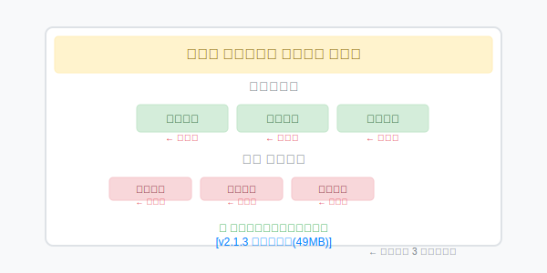

# 第 3 章：装软件像点外卖，但你可能点到了"地沟油"

> 你想装一个视频播放器。百度搜索，看到第一个结果是"官方下载"，点进去，那个绿色的大按钮写着"高速下载"。下载、双击、狂点下一步。
>
> 三天后，你的电脑多了三个浏览器主页、两个游戏客户端、一个"系统加速大师"。原来的视频播放器还没装好。
>
> 你每一步都走对了——除了第一步就走错了网站。

## 安装的本质

安装软件就是把程序文件复制到正确的位置，然后告诉操作系统这东西可以运行了。"告诉操作系统"这个步骤，在 Windows 上主要做两件事：

**写注册表。** 注册表是 Windows 的核心配置数据库——软件版本、安装路径、文件关联（比如 `.txt` 文件默认用记事本打开）都写在这里。所以卸载软件不能只删文件夹，注册表里的记录还在。

**加 PATH。** 有些软件会在系统 PATH 环境变量里加上自己的路径，这样你在命令行里直接输它的名字就能启动，不用输完整路径。

这就是为什么装完某些软件要重启——有文件被锁定了，重启后才能完成注册。

不同系统的安装方式：

| 系统 | 安装方式 | 要点 |
|:---|:---|:---|
| **Windows** | 下载 `.exe` 或 `.msi` 运行安装程序 | 小心每一步的勾选项 |
| **macOS** | 下载 `.dmg` 把图标拖进 Applications | 从官网或 App Store 下载 |
| **Linux** | 命令行 `apt install / brew install` | 官方仓库最安全 |
| **安卓** | 应用商店下载 | 别装来路不明的 APK |
| **iOS** | App Store | 只有这一个来源 |

### 为什么 Windows 最容易翻车

Windows 从 1985 年至今一直保持向后兼容——30 年前的软件理论上还能跑。这带来了巨大的安全隐患：任何程序都能修改系统核心位置。

对比其他系统：
- **macOS** 有 Gatekeeper，只让认证过的软件运行
- **Linux** 软件大多来自官方仓库，经过审核
- **iOS** 沙盒机制，每个 APP 待在自己的隔间里

Windows 的开放是它成功的理由，也是它混乱的根源。

### 安卓 APK 侧载的风险

从浏览器下载 APK 文件安装，整个过程不经过应用商店审核。恶意 APK 可以窃取短信验证码、后台静默扣费、读取通讯录上传。

**安全底线：**
- 只在 Google Play 或手机品牌自带商店下载
- 非要用 APK，只从应用官网或可信源下载
- 安装完就关闭"允许安装未知来源应用"
- 那些"破解版""无限金币版"的 APK——带毒概率极高

---

## 怎么下载才安全

互联网下载站的套路几十年没变过：**所有显眼的按钮都是假的，真实的下载链接藏在角落里。**



安全下载的几条铁律：

**1. 直接走官网**
在地址栏输入 `www.软件名.com`，不要点搜索结果里的"官网"标签——那是广告位。

**2. 看域名**
`baidu.com` 是百度，`baidu-download.com` 大概率是山寨。

**3. 看数字签名**
右键安装包 → 属性 → 数字签名。有大公司签名的相对可信。

**4. 看文件大小**
一个正经的视频播放器不可能只有 5MB。如果安装包小得可疑，它大概率是一个"下载器"，等下会给你下一堆别的东西。

### 各平台安全来源

| 系统 | 首选 | 次选 | 避免 |
|:---|:---|:---|:---|
| **Windows** | 微软商店、软件官网 | 腾讯软件中心等审核平台 | 第三方下载站、高速下载器 |
| **macOS** | App Store | 官网下载 | 来路不明的 `.dmg` |
| **Linux** | `apt`/`yum`/`pacman` 官方仓库 | Snap/Flatpak | 编译源码（新手慎用） |
| **安卓** | Google Play / 品牌应用商店 | 官网 APK | 破解站下载的 APK |
| **iOS** | App Store（别无选择） | — | 越狱设备 |

### 关于破解软件

说实话——我知道"去官网下载"这个建议对很多学生来说不现实。Adobe 套装一年几千块，你一个月生活费都没那么多。去百度搜"Photoshop 免费版"几乎是必然的。

如果你确实要用破解软件，至少做到这几点把风险降到最低：

**1. 用沙盒或虚拟机运行。** Windows Sandbox（Win 10/11 专业版自带）或虚拟机里运行破解程序，即使有毒也影响不到主系统。试完确认没问题再拿出来用。

**2. 只去你知道名字的破解站点。** 不要去百度搜出来的不知名博客。去有一定社区口碑的地方——至少有人帮你踩过坑。

**3. 装完杀毒软件全盘扫一遍。** Windows Defender 足够。如果破解器报毒，大概率是真毒——不是误报。

**4. 别用"管理员身份运行"跑不明程序。** 很多破解器要求右键→以管理员身份运行，给了它系统最高权限。这一步要想清楚。

这不是鼓励你用盗版。这是告诉你：**如果一定要用，别裸奔。**

（所谓的"破解版"是最常见的特洛伊木马传播渠道。特洛伊木马就是那种看起来正常——界面和正版一模一样——但在后台偷你的账号、加密你的文件、或者把你的电脑变成肉鸡去攻击别人。你运行破解器的同时可能已经给它开了后门。）

---

## 安装时的"下一步"陷阱

这是最容易被忽略的环节。你兴奋地双击安装包，满脑子只想快点用上，于是狂点"下一步"——正中下怀。

一个典型的安装界面长这样：

```
欢迎安装 超级播放器！
☑ 设置 XX 导航为默认主页     ← 默认勾选，取消它
☑ 安装 XX 游戏中心           ← 捆绑软件，取消它
☑ 加入用户体验计划           ← 稳妥起见，取消它

[快速安装] [自定义安装]       ← 永远选"自定义"
```

**基本原则：永远选"自定义安装"，逐项读完所有勾选再点下一步。**

安装程序的每一个默认勾选，目的都是为别人创造价值，不是为你。浏览器主页、捆绑软件、用户体验计划——这些不是"功能"，是商业模式。

::: tip 所谓"免费软件"的商业模式
你以为免费软件是福利。实际上：软件作者从捆绑推广中拿钱，推广商获得了用户安装量，而你——为了一款免费软件，付出了电脑变慢、浏览器被劫持的代价。

**这就是"地沟油"的完整产业链。**
:::

::: info 共享软件：互联网早期的软件分发方式
1990 年代，没有应用商店，软件靠杂志附赠光盘和 BBS 论坛传播。当时的商业模式叫**共享软件（Shareware）**：作者让你免费试用 30 天，到期后弹窗提醒购买，你寄支票过去，作者给你注册码。

最经典的案例是 WinZip——1991 年发布，定义了 `.zip` 格式。每次打开都提醒"请购买"，但很多人用了十几年都没买。

这种模式后来为什么消失了？因为互联网让软件传播太快、盗版太容易，免费+广告比共享软件赚钱得多。
:::

### 安装位置

Windows 软件默认装 `C:\Program Files`，保持默认就行。如果你 C 盘空间吃紧，也可以在自定义安装时手动改到 D 盘或其他分区。真正需要警惕的是那些**不给你自定义选项的安装程序**——点"快速安装"一路下一步，捆绑软件就趁你不注意装好了，路径在哪你根本没机会选。

---

## 卸载的正确姿势

**删除快捷方式 ≠ 卸载软件。** 快捷键只是一个入口，删掉的只是入口，软件本体还在硬盘里躺着。

### 各系统的正解

**Windows：**
`Win + I` → 应用 → 应用和功能 → 找到软件 → 卸载

不要直接删文件夹，不要右键删快捷方式。去设置里走正式流程。

**macOS：**
访达 → 应用程序 → 把图标拖进废纸篓

**Linux：**
```bash
sudo apt remove 软件名     # 卸载
sudo apt purge 软件名      # 卸载 + 清理配置文件
```

**安卓：**
长按图标 → 卸载；或设置 → 应用管理 → 卸载

**iOS：**
长按图标 → 删除应用

::: warning 为什么不能直接删文件夹
Windows 的软件安装会在多处留下痕迹：
- 程序文件在 `Program Files` 里
- 配置文件可能在 `AppData` 里
- 注册表里有几十条相关记录

只删文件夹就像把树砍了但不挖根——迟早会冒出新问题。
:::

---

## 包管理器：命令行版的"应用商店"

如果你厌倦了手动下载→安装→卸载的流程，包管理器是一个更好的选择。

**包管理器做的事情：**
- 从官方仓库下载软件
- 自动处理依赖（A 软件依赖 B 库，B 库版本不能太低…这些它帮你搞定）
- 一键更新所有已安装软件
- 卸载时清理干净

**各系统包管理器：**
- **macOS：** Homebrew（`brew install 软件名`）
- **Windows：** Winget（微软官方）、Chocolatey
- **Linux：** `apt`、`yum`、`pacman`

```bash
# macOS 用 Homebrew 安装 VLC
brew install vlc

# Windows 用 Winget
winget install VideoLAN.VLC

# Ubuntu
sudo apt install vlc
```

::: info 包管理器的意义
Linux 的包管理器生态是它最被低估的设计——所有软件集中在官方仓库，一个命令完成安装更新卸载，没有捆绑、没有假按钮、没有地沟油。Windows 和 macOS 这些年也在往这个方向走，但生态碎片化严重，短期内很难追上。
:::

### 供应链攻击：你以为可信的来源也可能出事

包管理器的安全前提是"官方仓库是可信的"。但 2024 年发生了一起标志性事件：有人往 xz（一个广泛使用的 Linux 压缩库）的代码里植入了后门，差一点就混进了主流发行版的仓库。如果没被及时发现，全球数百万台 Linux 服务器都会受影响——而攻击者是通过几年时间逐步取得维护者信任的。

npm（JavaScript 的包管理器）和 PyPI（Python 的包管理器）也频繁出现恶意包：攻击者上传名字跟流行库只差一个字母的包，你装错了就等于自己把后门装进项目里。

**这不是你个人能完全防御的。** 但你至少要知道：
- 你装的软件可能依赖几十个第三方库，任何一个被攻破都有风险
- 从官方商店/仓库下载能降低风险，但不能归零
- 长期不更新的老软件、冷门小软件、个人作者的作品——风险相对更高

---

## 驱动程序和运行库

这两个概念如果理解到位，能帮你省很多事。

### 驱动程序

驱动是操作系统和硬件之间的翻译官。新装一个显卡、打印机、网卡，Windows 基本上能自动识别并安装驱动。

什么时候需要手动干预：
- **Windows 自动更新找不到驱动** → 去设备官网下载
- **现有驱动有问题**（蓝屏、没声音、网卡不工作）→ 更新或回滚驱动
- **游戏性能异常** → 更新显卡驱动（NVIDIA/AMD 官网直接下）

**不要用驱动精灵、驱动人生这类工具。** 它们确实方便，但经常给你装错版本，附带一堆捆绑软件。驱动这种系统底层的东西，越少经手第三方越好。

### 运行库

运行库是软件的"共享零件包"。每个软件不需要自己实现所有功能——它直接调用系统里已有的运行库。

常见运行库：
- Visual C++ Redistributable（几乎所有 Windows 软件都需要）
- .NET Framework（部分 Windows 软件依赖）
- Java Runtime（跨平台软件）

普通用户通常不需要主动安装——游戏平台（Steam、Epic）和开发工具会自动补全。报错提示"缺少 dll 文件"时再去装也不迟。

---

## 常见问题

**Q：遇到"此应用可能不适配你的电脑"提示怎么办？**

A：64 位系统跑 32 位软件一般没问题。旧软件在新系统上运行可以试"兼容性模式"（右键 → 属性 → 兼容性）。

---

**Q：提示"需要管理员权限"怎么办？**

A：知名软件放心点允许。不确定的软件先查一下口碑再决定。

---

**Q：Mac 提示"无法验证开发者"怎么办？**

A：系统设置 → 隐私与安全性 → 找到被阻止的软件 → 点"仍要打开"。或者按住 Control 键点击软件图标再选打开。

---

**Q：怎么判断电脑上哪些软件是多余的？**

A：设置 → 应用 → 应用和功能，按安装日期排序。问自己最后一个问题：这个软件我上次用是什么时候？超过 3 个月没碰过的基本可以卸。

---

**Q：什么是"全家桶"？**

A：一个软件装完后自动帮你装一串其他软件。识别方法：安装界面有很多默认勾选项、安装包很小但功能吹得很大。安装时仔细看每一步，取消所有多余勾选。

---

## 思考题

"如果所有软件都像 iOS 应用那样，只能从官方商店下载，软件生态会变更好还是更糟？"

提示：安全 vs 自由，审核 vs 创新，垄断 vs 竞争……

---

## 下章预告

软件管好了。接下来解决一个更烦人的问题——Wi-Fi。

[第 4 章：Wi-Fi 连不上？先试试重启大法](./04-wifi-troubleshooting.md)

---

::: info "免费"的代价
你可能不知道，捆绑安装这种模式起源于中国。2010 年左右，某知名杀毒软件开创了"免费 + 捆绑"的模式：免费提供杀毒软件，但会捆绑安装浏览器、安全卫士、输入法。其他公司迅速跟进，发展成了今天无处不在的"全家桶"。

免费不是没有代价——只是代价换了一种支付方式。
:::
