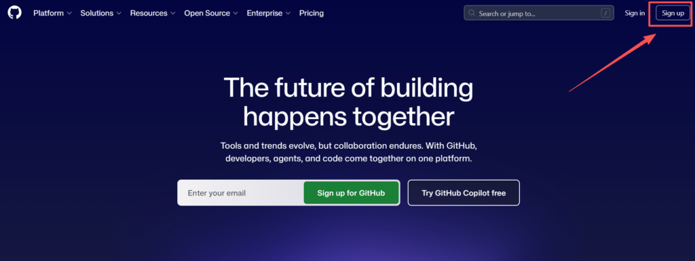
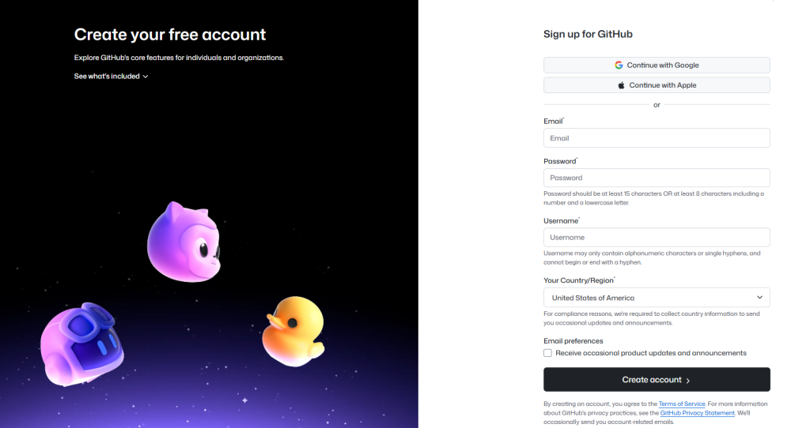
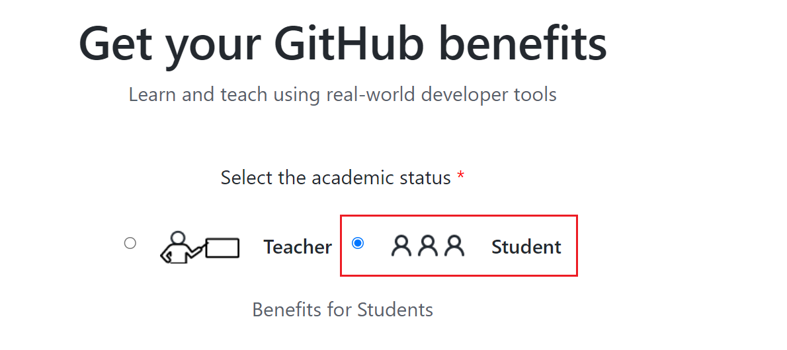
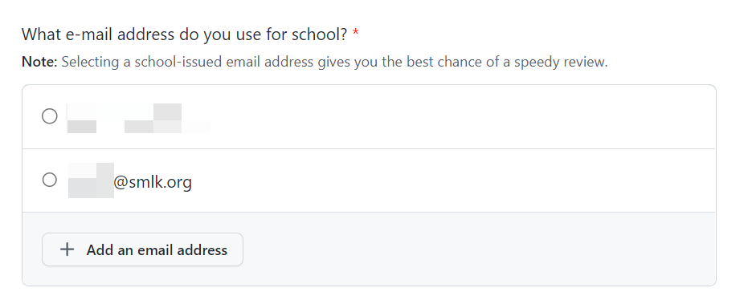
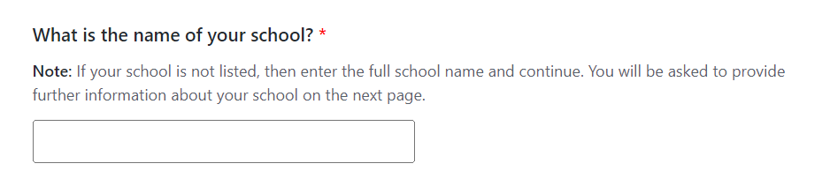
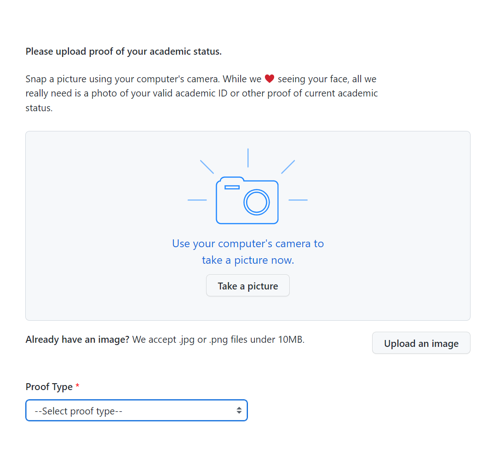
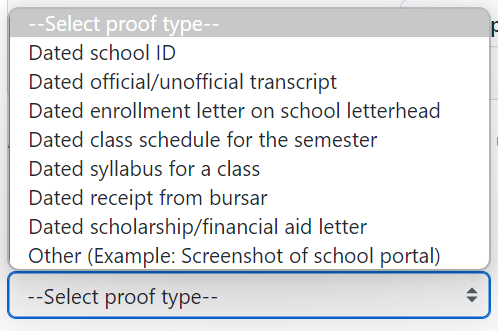
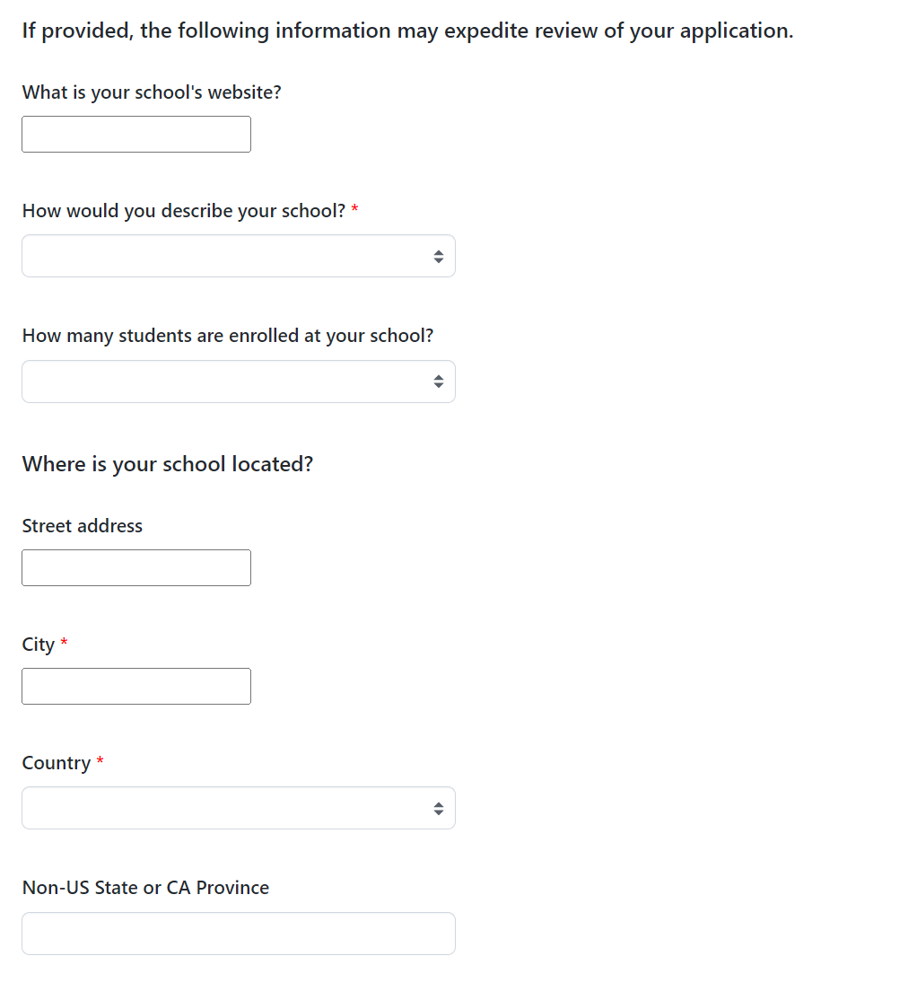

# GitHub 完全入门指北：注册、基础使用与教育优惠申请


## 1. 前言：网络访问准备

在开始注册和使用 GitHub 之前，我们需要先解决一个现实问题：**在中国大陆访问 GitHub 经常会遇到速度慢、无法连接的情况**。本节将详细讲解原因和解决方案。

### 1.1 为什么在中国访问 GitHub 不稳定？

GitHub 作为全球最大的代码托管平台，其服务器主要部署在美国。在中国访问 GitHub 不稳定，主要原因包括：

- **国际带宽限制**：跨国网络传输受到物理距离和带宽资源限制
- **DNS 污染**：域名解析被干扰，导致无法正确获取 GitHub 的 IP 地址
- **SNI 阻断**：深度包检测技术可能干扰 HTTPS 连接
- **IP 封锁**：部分 GitHub 的 IP 地址段可能被限制访问

此外，GitHub 自身也会部署反爬虫机制。2025年曾有报道，GitHub 会检查用户浏览器的语言设置，如果检测到中文（zh_CN）且 IP 质量较差，可能会触发访问限制。但正常用户通过优质 IP 访问通常不会受影响。

### 1.2 GitHub 访问限制的真相

需要澄清一个重要事实：**GitHub 并没有专门针对中国大陆进行封锁**。实际上，GitHub 是一家遵守美国法律的美国公司，其对某些国家/地区的限制主要是由于美国政府的制裁政策。

例如，GitHub 曾因美国制裁而限制伊朗、俄罗斯等国的账户访问。2025年4月，GitHub 曾短暂出现中国 IP 无法访问的情况，但官方回应称这是**配置错误导致的技术故障**，而非故意封锁，问题很快得到修复。

因此，我们遇到的访问问题主要是网络层面的技术障碍，而非 GitHub 针对中国用户的限制。

### 1.3 解决方案一：使用镜像站

镜像站是将 GitHub 内容同步到国内服务器的网站，可以**直接访问无需特殊工具**。

#### 1.3.1 直接访问型镜像站（可浏览仓库、查看代码）

这类镜像站通过将 GitHub 内容同步到国内服务器，实现免代理直接访问。用户可以在镜像站上浏览仓库、查看代码、下载文件，操作界面与 GitHub 官网基本一致。

##### ⚠️ 重要安全警告：**切勿在镜像站登录 GitHub 账号！**

镜像站并非 GitHub 官方运营，**安全性无法保证**。如果在镜像站输入你的 GitHub 用户名和密码，存在以下风险：

- **密码窃取**：镜像站后台可能记录你输入的所有信息，直接盗取你的账号。
- **会话劫持**：即使只登录一次，镜像站也可能利用 Cookie 模拟你的身份，进行恶意操作（如删除仓库、篡改代码）。
- **个人信息泄露**：绑定邮箱、私人仓库内容等敏感信息可能被截获。

**因此，请严格遵守以下原则：**

- ✅ 仅使用镜像站进行**浏览公开仓库、下载文件**等无需登录的操作。
- ❌ **绝对不要**在镜像站点击“Sign in”或输入账号密码。
- 如果你需要执行涉及账号的操作（如创建仓库、提交代码、申请教育优惠），请务必通过官方渠道（GitHub.com）并确保网络通畅（可配合 Hosts 优化或代理工具）。

##### 🔍 如何自行搜索最新可用的镜像站？

镜像站的域名经常变动（可能因政策、服务器压力等原因失效），因此**学会自己寻找可用镜像站**比依赖固定列表更重要。以下是几种有效的搜索方法：

1. **使用搜索引擎**  
   在百度、Google（需代理）或 Bing 中尝试以下关键词组合：
   - `GitHub 镜像站 最新`
   - `GitHub 加速 2026`
   - `GitHub proxy site`
   - `GitHub 镜像 可用`

   通常可以找到一些技术博客、知乎问答或 GitHub 仓库（如 [FastGit](https://github.com/fastgitorg/fastgit) 的替代方案）中维护的更新列表。

2. **关注技术社区和开源项目**  
   许多开发者会在 GitHub 上创建仓库，专门收集和测试可用的镜像站。例如：
   - 在 GitHub 搜索 `github-mirror`、`github-proxy` 等关键词，按更新时间排序，找到近期更新的项目。
   - 留意一些知名技术社区（如 V2EX、掘金、CSDN）的讨论帖，评论区常有最新镜像分享。

3. **利用镜像站检测工具**  
   有些网站会定期测试并公布可用的 GitHub 镜像，例如：
   - [Ping.cn](https://www.ping.cn/)：可输入镜像站域名测试连通性。
   - 一些 GitHub 加速器的官网也会提供状态监控页面。

4. **备用方案：切换搜索词**  
   如果某个镜像站失效，不要局限于同一域名，尝试搜索其替代品。例如 `kkgithub` 失效后，可搜索 `github 镜像 2026` 找新出现的 `xxxgithub`。

##### 💡 找到镜像站后如何验证可用性？

在正式使用前，建议先进行简单测试：

- 访问镜像站首页，看是否能正常加载。
- 尝试打开一个热门仓库（如 `https://镜像站域名/vuejs/core`），检查代码能否正常浏览。
- 下载一个小文件，测试速度是否理想。

如果发现镜像站访问缓慢或内容不完整，立即换用其他候选。

##### 🧭 镜像站的局限性

- **功能受限**：大部分镜像站仅支持读取操作（查看、下载），不支持写入（如创建 Issue、发起 Pull Request）。
- **数据延迟**：镜像站与 GitHub 官方可能存在同步延迟，新更新的代码可能需要数小时甚至一天才能显示。
- **随时失效**：镜像站可能因域名被屏蔽、服务器关闭等原因突然无法访问，请做好心理准备，并常备多个备用方案。

##### 📌 更安全的替代方案

如果你需要频繁且安全地使用 GitHub 全部功能，建议优先考虑：

- **修改 Hosts 文件**（见 1.4 节）：直接连接 GitHub 官方服务器，无需登录风险。
- **使用代理工具**（见 1.5 节）：加密通信，完整还原 GitHub 原生体验。
- **Git 命令加速**（见 1.3.3 节）：仅针对 `git clone` 操作进行加速，不影响网页登录。

镜像站适合作为临时应急或快速查看代码的辅助工具，**不应作为日常主力访问方式**。

#### 1.3.2 文件加速型镜像站（专用于下载 Release、压缩包）

这类镜像站主要解决大文件下载超时问题，粘贴 GitHub 文件链接即可生成高速下载地址。

| 镜像站 | 链接 | 状态 | 适用场景 |
|--------|------|------|----------|
| ghp.ci | https://ghp.ci/ | ✅ 可用 | 简单快捷，下载速度可达 10-50MB/s |
| moeyy.cn/gh-proxy | https://moeyy.cn/gh-proxy/ | ✅ 可用 | 功能全面，支持 API、Git Clone |
| gh-proxy.com | https://gh-proxy.com/ | ✅ 可用 | 支持批量文件加速 |
| ghproxy.net | https://ghproxy.net/ | ✅ 可用 | 稳定可靠 |

**使用方法**：在原始 GitHub 链接前加上镜像站前缀。  
例如：`https://ghp.ci/https://github.com/用户/仓库/archive/master.zip`

#### 1.3.3 Git Clone 加速专用镜像

针对 `git clone` 命令优化，通过代理中转大幅提升克隆速度。

**gitclone.com** : https://gitclone.com
执行命令：`git config --global url."https://gitclone.com/".insteadOf https://`
配置后，直接使用原 GitHub 链接 clone，Git 会自动通过镜像站加速。

#### 1.3.4 高校及云厂商镜像（稳定性高）

| 镜像站 | 链接 | 说明 |
|--------|------|------|
| 清华镜像 | https://mirrors.tuna.tsinghua.edu.cn/github-release | 学术网络，稳定性极佳 |
| Gitee 镜像 | https://gitee.com/organizations/mirrors/projects | 码云官方镜像，包含数千热门项目 |

#### ⚠️ 镜像站使用注意事项（再次提醒）
- **不要登录 GitHub 账户**：在镜像站输入密码存在安全隐患
- **不要搜索敏感内容**：避免镜像站被和谐
- **镜像站可能失效**：如果某个无法访问，请尝试列表中的其他选项

### 1.4 解决方案二：修改 Hosts 文件

通过修改系统 hosts 文件，跳过 DNS 解析，直接连接 GitHub 的高速 IP。

#### 操作步骤
1. **获取最新 hosts 内容**：访问 https://github.com/521xueweihan/GitHub520 复制配置
2. **修改 hosts 文件**：
   - Windows：`C:\Windows\System32\drivers\etc\hosts`（管理员权限）
   - macOS/Linux：`/etc/hosts`
3. **刷新 DNS 缓存**：
   - Windows：`ipconfig /flushdns`
   - macOS：`sudo killall -HUP mDNSResponder`
   - Linux：`sudo systemd-resolve --flush-caches`

**缺点**：IP 地址可能变更，变慢后需重复更新。

### 1.5 解决方案三：代理工具（VPN/机场）

对于需要频繁访问 GitHub 的用户，使用代理工具是更稳定、全面的解决方案。

#### 1.5.1 基本概念
- **VPN**：虚拟私人网络，加密所有流量
- **机场**：基于 Shadowsocks/V2Ray/Trojan 等协议的代理服务，提供多个节点
- **客户端软件**：Clash、Shadowrocket（小火箭）、Quantumult X 等

#### 1.5.2 如何选择
- **新手**：可选择提供免费试用或低价套餐的机场服务
- **技术用户**：可自行购买海外云主机搭建代理
- **学术用途**：部分高校和科研机构提供学术加速服务

#### 1.5.4 免费机场资源与寻找教程

**重要提示**：免费机场通常**稳定性差、速度慢、节点少**，且存在**隐私泄露风险**（详见 1.5.5）。仅建议短期试用或应急，长期使用请考虑付费服务。

##### 如何自己寻找免费节点

1.  **使用 Telegram 频道**：在 Telegram 搜索 `@freeproxies`、`@ClashNode` 等关键词，很多频道会定时推送免费节点。
2.  **利用搜索引擎**：在 Google 或 Bing 搜索以下关键词：
    - `免费Clash节点订阅 2026`
    - `免费机场订阅链接`
    - `free proxy list clash`
3.  **关注技术论坛**：如 V2EX、Nodeseek 等社区，常有人分享临时节点或邀请码。
4.  **机场聚合站**：访问一些机场推荐网站（如“机场收集表”、“毒奶机场测速”），它们会收录大量机场（含免费套餐）并定期测速。


#### 1.5.5 重要法律提示与机场风险

##### 法律红线：必须遵守中国法律法规

根据《中华人民共和国民用航空法》及网络安全相关法规，使用 VPN 或代理工具**必须遵守当地法律法规**，不得用于非法活动。 以下行为**严禁**：

- ❌ 利用代理访问非法网站、传播违法信息。
- ❌ 利用代理进行网络攻击、黑客行为。
- ❌ 利用代理从事电信诈骗、赌博等犯罪活动。

**合法用途**：仅用于正常的学术研究、技术学习、访问开源社区（如 GitHub）、查阅国际文献等正当目的。

##### 机场服务的五大风险

1.  **隐私泄露风险（最高危）**
    - 所有流量都经过机场服务器，如果机场运营者恶意记录，你的账号密码、浏览记录、聊天内容都可能被窃取。
    - **后果**：轻则隐私泄露，重则银行账户被盗、社交账号被黑。
    - **防范**：选择有信誉的付费机场（运营时间长、用户评价好），**绝对不要**在免费机场输入任何敏感信息。

2.  **中间人攻击风险**
    - 恶意机场可能劫持你的 HTTPS 连接，即使网站有小锁标志，仍可能被窃取数据。
    - **征兆**：访问银行、支付网站时出现证书错误警告，立即停止使用。

3.  **恶意软件感染风险**
    - 部分免费机场会在订阅链接中植入恶意节点，或在客户端安装包中捆绑病毒、挖矿程序。
    - **防范**：只从官方 GitHub 下载客户端，不要使用来路不明的“定制版”。

4.  **节点污染与封号风险**
    - 免费节点通常被大量用户共用，IP 地址容易被网站拉黑（如 ChatGPT 封禁、Netflix 检测代理）。
    - 部分机场使用“隧道中转”技术，但免费服务很少提供，导致速度极慢。

5.  **跑路与数据残留风险**
    - 免费机场随时可能关闭，且关闭后服务器数据如何处理未知。你的历史记录可能被倒卖或泄露。

##### 安全使用建议

- ✅ **优先选择付费机场**：月付 10-30 元的服务通常能保证基本安全，运营者更珍惜声誉。
- ✅ **开启浏览器隐私模式**：访问敏感网站（如网银、邮箱）时，建议关闭代理或使用隐私窗口。
- ✅ **定期检查订阅来源**：删除不再使用的订阅链接。
- ❌ **不要在机场网站使用相同密码**：注册机场时，使用和主邮箱不同的密码。
- ❌ **不要在代理状态下进行敏感操作**：如网上银行转账、登录工作系统等，建议切换至直连模式。

**总结**：代理工具是技术学习的辅助手段，但**安全永远是第一位的**。选择可靠的机场、遵守法律法规、保护个人隐私，才能让 GitHub 之旅既顺畅又安心。**

### 1.6 如何选择适合你的方案？

| 使用场景                        | 推荐方案           | 理由         |
| --------------------------- | -------------- | ---------- |
| 偶尔查代码、下载小文件                 | 镜像站            | 无需配置，打开即用  |
| 需要 git clone 项目             | Git Clone 加速镜像 | 一次配置，长期生效  |
| 下载大文件（如 Release 包）          | 文件加速型镜像        | 速度快，支持断点续传 |
| 频繁使用 GitHub，需要登录            | Hosts 优化 + 代理  | 完整功能，稳定连接  |
| 需要使用 GitHub 全部功能（如 Actions） | 代理工具           | 完全模拟原生环境   |

**建议新手**：先从镜像站开始，熟悉 GitHub 操作后，再根据需要选择更高级的方案。

## 2. 第一部分：注册 GitHub 账号

### 2.1 访问官网
打开浏览器，访问 [GitHub 官网](https://github.com)。  
> **建议**：如果官网无法打开，可使用上述镜像站（如 `https://kkgithub.com`）完成注册流程。注意账号安全！

### 2.2 填写注册信息
在首页点击 **Sign up**，进入注册页面。



依次填写：
- **Username**（用户名）：全网唯一，建议使用有意义的英文名或昵称。
- **Email address**（邮箱地址）：推荐使用 Gmail、Outlook 等国际邮箱，避免某些国内邮箱收不到验证邮件。
- **Password**（密码）：至少包含一个数字、一个小写字母、一个大写字母，长度不少于 7 位。
- **Email preferences**：可选是否接收产品更新邮件，按需勾选。



填写完毕后，点击 **Create account** 进入下一环节。

### 2.3 验证邮箱地址
GitHub 会向你的注册邮箱发送一封验证邮件。  
- 登录邮箱，找到来自 GitHub 的邮件（若未收到，请检查垃圾箱）。
- 点击邮件中的 **Verify email address** 按钮，完成验证。
- 验证成功后页面会自动跳转。

### 2.4 选择账户类型
验证邮箱后，GitHub 会询问你计划使用免费版还是付费版。  
- 选择 **Free**（免费版）即可满足大多数个人需求。
- 后续步骤可能需要你填写一些调查问卷（如编程经验、使用目的），可以跳过或快速填写。

### 2.5 注册后的基础设置
- **设置头像**：在 Settings → Profile 中上传头像，让账户更专业（二次元头像可以加强编程能力（不是））。
- **开启双重验证**（可选）：Settings → Password and authentication → Enable two-factor authentication，增强账户安全。（这是github的强制要求，推荐开启）
- **探索个人仪表盘**：登录后首页会显示动态、推荐项目等。

## 3. 第二部分：GitHub 基础使用

### 3.1 核心概念速览
| 术语 | 说明 |
|------|------|
| **Repository（仓库）** | 存放代码、文件、版本历史的地方，相当于一个项目文件夹。 |
| **Branch（分支）** | 独立的开发线，默认主分支叫 `main`。可在分支上修改而不影响主代码。 |
| **Commit（提交）** | 保存一次更改的记录，类似“快照”。 |
| **Pull Request（PR）** | 请求将某分支的更改合并到另一分支（如 `main`），常用于代码审查和协作。 |
| **Fork** | 复制他人仓库到你自己的账户，可自由修改，然后通过 PR 向原仓库贡献。 |
| **Issue** | 任务、bug 报告或讨论区，用于项目管理。 |
| **Star** | 收藏仓库，类似点赞，方便后续查找。 |
| **Watch** | 关注仓库，接收该仓库的动态通知。 |

### 3.2 创建第一个仓库
1. 登录后，点击右上角 **+** 号，选择 **New repository**。
2. 填写仓库名称（必填），例如 `hello-world`。
3. 可选添加描述（Description）。
4. 选择仓库可见性：
   - **Public**（公开）：所有人都能看到。
   - **Private**（私有）：仅你和协作者可见（免费版也可创建私有仓库）。
5. 勾选 **Initialize this repository with a README**（建议勾选，自动生成说明文件）。
6. 点击 **Create repository** 完成创建。

### 3.3 上传文件到仓库
#### 方法一：直接网页上传
1. 进入仓库首页，点击 **Add file** → **Upload files**。
2. 将文件或文件夹拖拽到上传区域，或点击选择文件。
3. 在页面底部填写本次上传的说明（Commit message），例如“添加项目文档”。
4. 点击 **Commit changes** 完成上传。

#### 方法二：使用 Git 命令行（适合批量操作）
```bash
# 克隆仓库到本地（先获取仓库地址）
git clone https://github.com/你的用户名/仓库名.git

# 进入仓库目录
cd 仓库名

# 将文件复制到该目录下

# 添加所有更改
git add .

# 提交更改
git commit -m "添加新文件"

# 推送到 GitHub
git push
```

### 3.4 克隆仓库到本地
克隆意味着将远程仓库完整下载到本地电脑，便于离线工作。  
在仓库首页点击绿色 **Code** 按钮，复制 HTTPS 或 SSH 链接。  
然后在终端执行：
```bash
git clone 复制的链接
```
例如：
```bash
git clone https://github.com/yourname/hello-world.git
```

如果克隆速度慢，可以使用前面介绍的镜像站加速：
```bash
# 使用 gitclone.com 加速
git clone https://gitclone.com/github.com/yourname/hello-world.git

# 或配置全局镜像（推荐）
git config --global url."https://gitclone.com/".insteadOf https://
git clone https://github.com/yourname/hello-world.git  # 自动加速
```

### 3.5 发起一个 Pull Request
假设你想向别人的仓库贡献代码：
1. **Fork** 目标仓库到你自己的账户。
2. 在你 fork 的仓库中修改代码并 commit。
3. 回到原始仓库页面，点击 **Pull requests** 标签 → **New pull request**。
4. 选择 **compare across forks**，将你的 fork 仓库与原始仓库的主分支进行比较。
5. 填写 PR 标题和描述，说明你的改动。
6. 点击 **Create pull request** 提交。

### 3.6 探索更多功能

GitHub 不仅仅是一个代码仓库，它还提供了丰富的工具和功能，帮助你更高效地开发、协作和管理项目。以下是一些值得探索的常用功能：

##### **Issues（问题追踪）**
在仓库的 **Issues** 标签页，你可以创建新问题来报告 bug、提议新功能或进行任务讨论。每个 Issue 都可以分配责任人、添加标签、关联里程碑，并支持 Markdown 格式的详细描述。团队协作时，Issues 是沟通的核心工具。

##### **Projects（项目看板）**
使用 **Projects** 功能，你可以通过看板（Kanban）形式管理任务。将 Issues 和 Pull Requests 组织成“待办”、“进行中”、“已完成”等列，直观地跟踪项目进度。支持自动化规则（如当 PR 合并时自动移动卡片），让项目管理更轻松。

##### **Wiki（维基文档）**
每个仓库都可以拥有自己的 **Wiki**，用于编写详细的文档、使用指南或设计规范。Wiki 本身也是一个 Git 仓库，支持版本控制，你可以像管理代码一样管理文档。

##### **Actions（自动化工作流）**
**GitHub Actions** 是内置的 CI/CD 工具，让你能够自动化构建、测试和部署流程。通过编写 YAML 配置文件，你可以设置当代码推送时自动运行测试、发布版本时自动打包等操作。Actions 拥有丰富的生态市场，可以直接使用社区分享的工作流模板。

##### **Pages（静态网站托管）**
**GitHub Pages** 可以将仓库中的静态文件（HTML、CSS、JavaScript）直接发布为网站。只需在仓库设置中开启 Pages 功能，选择分支和文件夹，即可获得一个 `https://用户名.github.io/仓库名` 的访问地址。非常适合搭建个人博客、项目展示页或文档站点。

##### **Codespaces（云端开发环境）**
**GitHub Codespaces** 提供基于浏览器的云端 VS Code 开发环境。你可以在任何设备上打开仓库，立即获得配置好的开发容器，无需本地搭建环境。适合快速原型开发、代码审查或临时修改。

##### **Discussions（社区讨论）**
**Discussions** 是一个论坛式的空间，用于项目相关的开放式讨论、问答和公告。与 Issues 不同，Discussions 更适合 brainstorming、用户反馈和知识分享，帮助建立社区氛围。

##### **GitHub Desktop（桌面客户端）**
对于不熟悉命令行的用户，**GitHub Desktop** 提供了图形化的 Git 操作界面。你可以直观地查看文件变更、创建分支、提交代码、同步远程仓库，甚至解决合并冲突。支持 Windows 和 macOS，与 GitHub 账户无缝集成，是入门 Git 的绝佳工具。

**下载地址**：[https://desktop.github.com](https://desktop.github.com)  
**主要功能**：
- 可视化提交历史
- 拖拽式分支管理
- 一键克隆仓库
- 与 GitHub 协作功能深度整合（如创建 PR、查看 CI 状态）

##### **GitHub Mobile（移动端应用）**
**GitHub Mobile** 让你在手机上随时随地进行代码协作。无论是查看代码、审查 Pull Request，还是回复 Issue、合并分支，都可以通过 iOS 或 Android 应用完成。

**下载方式**：在 App Store 或 Google Play 搜索 “GitHub” 下载。（或你可以上网寻找第三方镜像站下载）
**主要功能**：
- 浏览仓库文件和代码（支持语法高亮）
- 查看和回复 Issue、PR 评论
- 合并 Pull Request
- 接收仓库动态通知
- 支持生物识别登录（指纹/面容）

## 4. 第三部分：GitHub 教育优惠申请

## 4. 第三部分：GitHub 教育优惠申请

> 本节内容参考了 Akari 撰写的《Github学生认证及学生包保姆级申请指北》（[博客地址](https://www.lhcloud.com.cn/archives/2/)），并结合 2026 年最新申请经验进行了补充和更新。在此对原作者的分享表示感谢。

### 4.1 什么是 GitHub 学生开发者包？

GitHub 学生开发者包（GitHub Student Developer Pack）是 GitHub 联合多家合作伙伴为在校学生提供的免费工具和服务集合。包含 GitHub Pro、GitHub Copilot、JetBrains IDE、域名、云资源等价值数百美元的福利。详情可访问 [官方页面](https://education.github.com/pack)。

> **注意**：第三方福利（如域名、云额度）通常为一次性，即使后续重新认证也无法再次领取，请谨慎选择领取时机。

### 4.2 申请条件

- 目前就读于初高中、学院、大学、家庭学校等可授予学位或文凭的教育机构。
- 拥有一个可验证的学校邮箱（如 `.edu.cn` 后缀）或能够上传证明当前学生身份的文件。
- 年满 13 周岁。

### 4.3 重要注意事项（必读）

#### ⚠️ 网络与定位要求
- **全程禁止使用代理**（除下文“特殊情况”中为解决 Bing 地图加载问题可临时代理特定域名外）。
- **务必关闭 VPN/代理工具**，并确保网络环境为国内直连。
- **建议开启定位权限**，并在学校附近进行定位（可使用手机或电脑的虚拟定位软件模拟学校位置）。
- **优先使用校园网**进行申请，可显著提高通过率。

#### ⚠️ 账户信息一致性要求（新增）
GitHub 在审核学生申请时，可能会核对申请人姓名与证明材料上的姓名是否一致。为降低被拒风险，**请在申请前完成以下设置**：

1. **修改账单信息（Billing information）中的姓名**：  
   进入 GitHub 设置 → **Billing and plans** → **Payment information** → **Add billing info**，将 **First name** 和 **Last name** 填写为你的真实姓名（应与学生证/学信网上的姓名一致）。  
   *原因：账单姓名是账户身份的重要组成部分，与证明材料一致可增加可信度。*

2. **修改个人资料中的显示名称（昵称）**：  
   进入 GitHub 设置 → **Profile**，将 **Name** 字段填写为你的真实姓名（中文或英文均可）。此姓名将显示在你的个人主页上，建议与证明材料保持一致。  
   *注意：这不是用户名（username），而是可自定义的显示名称。*

#### ⚠️ 材料准备建议
- **优先使用手机操作**：GitHub 目前更倾向于通过摄像头实时拍摄证明材料（而非上传本地文件），手机操作更方便。
- **拍摄时确保清晰**：请对焦清楚，保证文字和公章可辨识。
- **推荐材料顺序**：录取通知书（带学校公章） > 学信网学籍报告（英文版或使用浏览器自动翻译） > 学生证（需包含学校名称、公章、个人信息、有效期） > 其他（通过率低）。

### 4.4 申请步骤详解

#### 步骤 1：注册/登录 GitHub 账号
如果你还没有账号，请参考本文 [第二部分](#2-第一部分注册-github-账号) 完成注册。

#### 步骤 2：进入申请页面
访问 [GitHub Education 申请页面](https://education.github.com/discount_requests/pack_application)，点击 **Get student benefits**。

#### 步骤 3：选择身份
选择 **Student**。



#### 步骤 4：选择邮箱
- 如果你有学校邮箱（如 `yourname@xxx.edu.cn`），务必在邮箱列表中选择它（可点击 **Add an email address** 添加）。学校邮箱可大幅提高自动验证的概率。
- 如果没有学校邮箱，则使用个人邮箱，后续需上传证明材料。

#### 步骤 5：填写学校信息
- **School name**：填写学校全称（中英文均可，建议与证明材料保持一致）。**不可使用缩写**，例如“华东理工大学”不能填“华理”或“ECUST”。推荐填写 `East China University Of Science and Technology`

- **How do you plan to use GitHub?**：简要说明即可，例如：  
  `I want to learn coding and contribute to open source projects.`

#### 步骤 6：提交证明材料
点击 **Continue** 后进入上传材料页面。**强烈建议使用手机摄像头（选择“Take a picture”）实时拍摄**，避免上传被系统标记为“不可信”。

- 拍摄时注意光线和清晰度。
- 拍摄后系统可能要求补充学校详细信息：
	 
  - 在 **What is your school's website** 中填入你学校的官方网址（`http://`或`https://`头无影响，如 `https://www.szu.edu.cn`）
  - 在 **How would you describe your school?** 中选择学校的办学性质（大学及大学学院选Higher-education）  
  - 在 **How many students are enrolled at your school** 中选择你所在年级的招生人数（非必填但建议填写（乱写没事））  
  - **School address**：填写学校地址（中文或英文均可）
	  - 在“City”中填写所在的城市，这里可以是 `上海/Shanghai`
	  - 在“Country”中选择所在的国家，其排列顺序按英文首字母来排列的。中国选择“China”即可 
	  - 在“Non-US State or CA Province”中填入所在的省份，这里还可以是 `上海/Shanghai`
	

#### 步骤 7：提交申请
点击 **Process my application** 完成提交。之后你会收到一封确认邮件，审核结果将在同一页面显示并邮件通知。

### 4.5 特殊情况：Bing 地图定位

部分申请者在提交后可能会遇到要求在地图上标记学校位置的页面。该地图由 Bing 提供，在国内访问时可能因跳转至 `cn.bing.com` 而无法加载。

**解决方法**：
- 临时代理以下域名以加载地图：` www.bing.com、bing.com、cn.bing.com`
- **警告**：除上述域名外，请勿代理其他任何域名（尤其是 GitHub 相关域名），否则可能导致申请失败。

地图加载后：
1. 在搜索框输入学校全名（中文）。
2. 点击 **Search**，选择带地址的结果。
3. 系统自动补全地址后，继续提交即可。

### 4.6 审核时间与结果查询

- **审核时间**：通常几分钟到几天不等，高峰期（如开学季）可能稍长。
- **结果查询**：访问 [GitHub benefits 页面](https://education.github.com/discount_requests/pack_application) 查看状态。
  - 绿色 **Approved**：表示审核通过，但福利尚未到账。
  - 紫色 **Approved**：表示福利已到账（通常需要 3 天左右同步）。
- 若被拒，可根据邮件提示的拒绝原因修改后重新提交。

## 5. 常见问题解答（FAQ）

**Q1：收不到 GitHub 的验证邮件怎么办？**  
A：检查垃圾邮件箱；若仍没有，更换邮箱重新注册（推荐 Gmail/Outlook）；也可以尝试在登录页面点击 **Resend verification email**。

**Q2：注册时提示用户名已被占用？**  
A：换一个独特的用户名，可在后面加数字或下划线，如 `yourname123`。

**Q3：使用镜像站安全吗？需要注意什么？**  
A：镜像站适合浏览和下载，但**切勿在镜像站登录 GitHub 账户**，以防密码泄露。登录操作请尽量在官网或使用代理时完成。

**Q4：教育优惠申请需要校园网吗？**  
A：不需要，任何网络均可，但提交的证明文件需真实有效。如果官网访问困难，可使用代理提交申请。

**Q5：GitHub 教育包的有效期是多久？**  
A：通常为 2 年，或直到你毕业。到期后可以续期（需再次验证学生身份）。

**Q6：使用 Git 时，每次 push 都要输入用户名密码，太麻烦？**  
A：可以设置 SSH 密钥，实现免密操作。具体方法：[GitHub SSH 配置文档](https://docs.github.com/zh/authentication/connecting-to-github-with-ssh)。

**Q7：如何删除一个仓库？**  
A：进入仓库 Settings，拉到最底部 Danger Zone，点击 **Delete this repository**，按提示输入仓库名确认。

**Q8：GitHub 会突然彻底无法访问吗？**  
A：根据 2025 年 4 月的“封禁乌龙”事件，GitHub 官方明确表示没有针对中国 IP 的封锁计划，那次是配置错误并已修复。但作为开发者，建议养成定期备份代码的习惯，并了解多种访问方案以备不时之需。

**Q9：学校要求必须使用学校邮箱申请，但我没有怎么办？**  
A：部分学校在申请时会提示“Please select a different email address. We require applicants of XXX University to use one of these school-issued email addresses”。如果你确实没有学校邮箱，可向 GitHub 教育支持提交工单，选择“My school has incorrect or incomplete information”，并提供学校 IT 部门关于邮箱政策的证明（如官网截图、官方说明等）。

**Q10：上传材料时提示“The item you uploaded is insufficient”怎么办？**  
A：通常是因为图片不清晰或经过修改。请重新拍摄清晰的证明材料，确保文字和公章可见。建议使用手机原相机拍摄，避免使用美颜或扫描 App。

**Q11：教育包福利多久到账？**  
A：审核通过后，福利通常会在 3 天内陆续到账（部分第三方服务可能需要手动激活）。你会在 GitHub 账户的 [Benefits 页面](https://github.com/settings/benefits) 看到可用福利列表。

**Q12：我已经毕业了，还能申请吗？**  
A：不能。但部分第三方服务（如 JetBrains）提供校友折扣，可单独申请。


## 6. 结语与资源推荐

通过本篇教程，你应该已经掌握了：
- 多种稳定访问 GitHub 的方法（镜像站、Hosts、代理）
- 注册 GitHub 账号的完整流程
- GitHub 基本操作（仓库、上传、克隆、PR）
- 申请教育优惠的完整流程

GitHub 是一个宝藏平台，除了代码托管，还有海量开源项目等待你探索。如果你希望深入学习，可以参考以下资源：
- [GitHub 官方文档](https://docs.github.com/zh)
- [Pro Git 中文版（免费书籍）](https://git-scm.com/book/zh/v2)
- [GitHub 入门指南（官方视频）](https://resources.github.com/github-and-git-fundamentals/)

**现在，开启你的 GitHub 之旅吧！**
